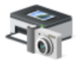
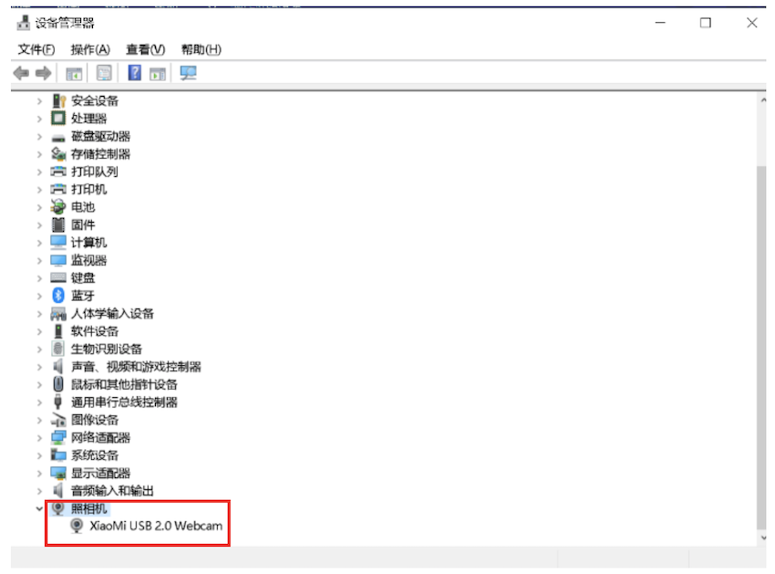
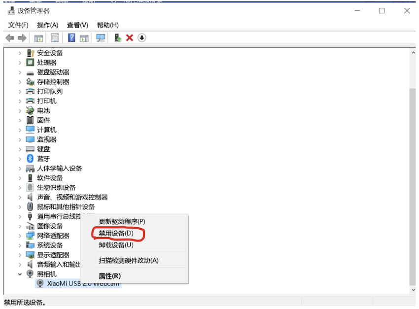

## FAQ:外接USB摄像头在Windows电脑上默认不启用的解决办法

使用外接USB摄像头时，有时在客户端中无法开启该摄像头的视频流，解决办法如下

### 1.打开设备管理器

 

### 2.找到照相机

 

### 3.找到电脑自带摄像头，鼠标右键点击设备名称，然后选择“禁用设备”，然后关闭设备管理器。

 

### 4.将外界摄像头通过USB连接电脑，再使用摄像头的时候就会启动USB摄像头了！