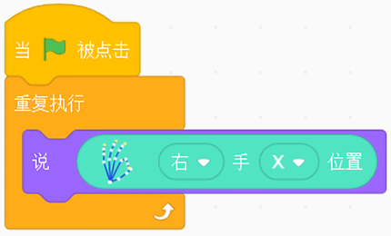
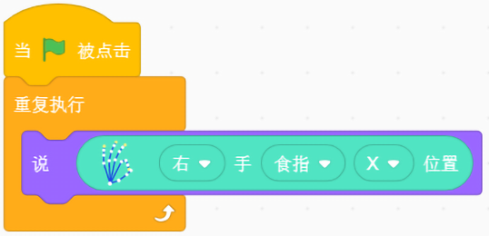

## 手势识别

### 手势识别介绍
	手势识别包括对手，手指，手势的识别  

### 硬件说明

体感控制器    

	
	使用包装盒中随附的USB电缆。控制器的光亮面朝上，绿灯面向您。进入https://developer.leapmotion.com/setup/desktop，下载所需的核心软件。

### 积木块说明
### 1. 手的位置
点击积木块，获得左手(右手)的X(Y和Z)的位置。

### 样例代码  
将积木块放入重复执行积木块，点击小旗子运行。舞台的小狮子会不停的“说”右手的X位置。  

### 2. 手旋转角度
点击积木块，获得左手(右手)的旋转角度。

### 样例代码  
将积木块放入重复执行积木块，点击小旗子运行。舞台的小狮子会不停的“说”右手的旋转角度。  

### 3. 手腕上下摆动角度
点击积木块，获得左手(右手)的手腕的上下摆动角度，朝上角度为正，朝下角度为负。

### 样例代码  
将积木块放入重复执行积木块，点击小旗子运行。舞台的小狮子会不停的“说”右手手腕摆动的角度。  

### 4. 手腕上下摆动角度
点击积木块，获得左手(右手)的食指(拇指，中指，无名指，小拇指)的X(Y,Z)的位置。

### 样例代码  
将积木块放入重复执行积木块，点击小旗子运行。舞台的小狮子会不停的“说”右手食指X的位置。  

### 5. 判断手势
点击积木块，当识别到指定手势(挥手，手指画圆，点击屏幕，点击键盘)时，触发。  

### 样例代码  
当识别出挥手的手势时，舞台的小狮子会说“在挥手”。  

---

