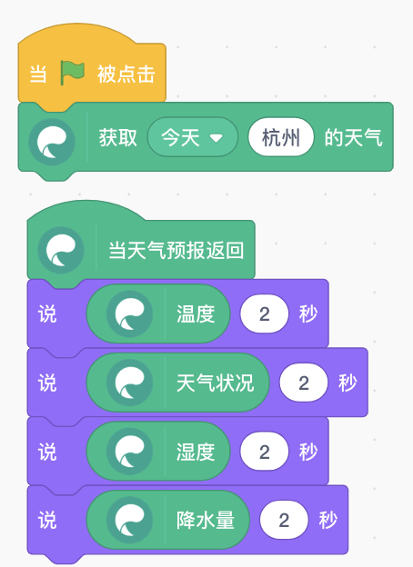
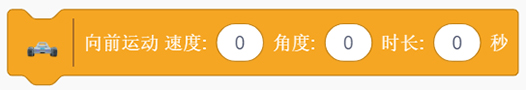

# 客户端介绍
小小创造家客户端基于最新的Scratch3.0，支持10多种好玩、有趣的人工智能和物联网的软、硬件插件积木，通过轻松地组合创造，虚实互动，让儿童充分体验到创新教育的乐趣。	
小小创造家客户端包含非常丰富的教育插件，包括智能家居、各类机器人、智能车、机器学习、大数据、物联网、Arduino和Micro:bit开源硬件等50余种人工智能软、硬件积木插件。

---
 
## 人脸识别
  
### 人脸识别介绍
	包括人脸检测和人脸识别，该插件基于dlna设备发现功能去获取自配置的小狮网关IP。

- `人脸检测` - 对有没有人脸，以及人脸基本特征进行检测
 	- 基本特征包括：年龄、性别、微笑度
-  `人脸识别` - 对检测出来的人脸匹配是否是已知的某个人
 	- 例如，匹配上是自己家人，或者不是自己家人
-	`人脸添加` - 将人脸添加到人脸库中
 	- 例如，将姓名“张三”和对应的人脸截图添加到人脸库中
 

### dlna设备发现说明  
	
	dlna可自动发现局域网内的小狮网关信息,加载人脸识别插件时，在弹框中显示所有扫描到的小狮网关信息。用户点击自己的小狮网关对应的IP即可获得对应机构的人脸库，获得人脸库之后可进行人脸操作。

#### dlna扫描发现

### 1. 打开IP相机积木
该积木块打开检测识别弹框窗口进行人脸识别和检测。

 

### 2. 打开IP相机添加人脸积木
该积木块打开人脸添加窗口，可进行添加人脸到人脸库操作。

 

### 3. 开始人脸检测积木
使用手机的ipwebcamera摄像头对应的ip进行人脸探测，探测人脸的特征，检测人脸之前需要打开检测识别弹框窗口。 
	

 

### 4. 当检测到人脸积木
当摄像头探测到人脸时，触发。

 

### 5. 人脸检测年龄积木
显示识别到的年龄。		

 

### 6. 人脸检测性别积木
显示识别到的性别。	
	

 

### 7. 人脸检测微笑度积木
显示识别的微笑度百分比结果。	
	

 

### 8. 开始人脸识别积木
使用手机的ipwebcamera摄像头对应的ip进行人脸识别，识别人脸姓名，识别人脸之前需要打开检测识别弹框窗口。  
	

 

### 9. 当识别到人脸积木
当摄像头识别到人脸结果时，触发。  

 

### 10. 人脸姓名积木
显示识别到的人脸对应姓名。

 

#### 示例	
使用手机摄像头开始检测人脸，当检测到人脸时，舞台角色说出已检测结果的年龄、性别和微笑度；当检测到是男性时，说出“这是一名男性”；并进行人脸识别，当人脸识别异步返回结果时，将识别的姓名说出。 	

---
 
## 语音识别

### 语音识别介绍			
	
	语音识别，文字播报。

	
 
### 1. 打开语音输入积木		
通过电脑麦克风输入语音，点击输入语音，可以选择语音输入的时间，默认输入时间为5秒	

 
### 2. 当语音识别返回结果积木		
当识别语音结束时执行	

 
### 3. 当语音识别返回结果积木（含特定词语）		
当识别到语音中包含给定词语时执行，默认包含“开始”	

 
### 4. 语音识别结果积木		
输出输入的语音结果。	

 
####示例		
点击小旗子，输入语音5秒，文字输出语音输入的结果。		

 
### 5. 选择人物声线积木
可以选择不同播报人物声线。	

 
### 6. 讲话积木
将选框内文字以语音输出，通过电脑麦克风播报出来		

 
####示例		
点击小旗子，用小宇的声线说出“你好呀”。	

---
 
## 机器学习

 
### 机器学习介绍			
	
	简单而强大的机器学习模型，快速学习三种类别的分类，并进行识别。
	- 图像
	- 声音
	- 骨骼（身体姿态）
	
 
### 1. 图像分类积木	
打开图像分类窗口	

	
 
####示例		
打开图像识别分类窗口，点击训练按钮，对不同分类进行训练，点击小旗子，说出分类一的信心值。例如，训练一个拳头，拳头的大部分角度训练达到100%，训练完成。	

	

	
 
另外，训练手势识别开灯的编程示例如下。		

 
### 2. 身体姿态分类积木		
打开身体姿态分类窗口	

	
 
####示例		
打开身体姿势分类窗口，点击分类一训练按钮，训练到分类一信心值为100%，
训练完成。对其他分类进行相同的训练操作，点击小旗子，说出分类一的信心值。	

	

 
### 3. 声音分类积木		
打开声音识别分类窗口	

 
####示例		
打开声音识别分类窗口，其中训练分类1采集背景音，至少采集四次，采集完背景音后可以开始训练其他分类。	
	

点击“开始转移学习”按钮，转移学习完成后，点击“开始”按钮。	
	
点击小旗子，说出分类一的信心值。

 
### 4. 识别结果积木
返回识别结果分类。	

 
####示例		
打开识别分类窗口，进行训练，说出识别结果。	
	
 
### 5. 判断识别结果积木	
判断识别结果是否为选区内分类。			
	

 
####示例		
打开识别分类窗口，进行训练，判断识别结果是否是分类一，若是，则说“是分类一啊”。	
	

---
 
##  数字转换

### 数字转换介绍
	中文大写数字转数字，以及时间提取功能的插件。   

 

### 1.大写转数字积木块
将中文大写数字转成阿拉伯数字，例如： ‘二十三’转成‘23’。	

 

### 2.提取时间数字积木块
将输入字段中的时间关键字转成对应的时间格式 例如：‘三分钟后’转成‘2020-03-02 12:00:00’。
	

 

### 3.到达指定时间积木块
当时间达到指定时间格式时，执行，输入的变量应为时间格式,(使用时将提取数字时间积木块的值赋值给一个变量，将变量输入到该积木块中。)

 

#### 示例		
	
当棋子被点击时，会将大写数字一转成‘1’并说出，并将当前时间三分钟后的时间转成时间格式赋值给时间变量，当当前时间达到时间变量规定的时间时，触发积木块，播报‘时间到了’。	

---
 
## 和风天气

###和风天气介绍
	获取你关心的城市的天气数据:   
	- 温度
	- 湿度
	- 天气状况
	- 降水量	
 
### 1. 读取今天天气
异步获取今天天气，可以在选框内，填入相应的地址。	

 
### 2. 今天天气结果已读取
当获得今天天气结果返回。		

 
### 3. 显示天气状态
获取温度，湿度，天气状况和降水量。	

 
####示例		
点击小旗子，读取杭州今天天气，然后说出杭州今天温度。	

 
### 4. 读取未来几天天气预报
可以在选框内，填入地址，并选择读取未来第几天的天气。	

 
### 5. 未来几天天气结果已读取
当天气预报返回结果时。		

 
####示例		
点击小旗子，获取杭州后天天气，然后说出温度。	

---
 

## 认知能力

### 认知能力介绍			
	
	识别特定种类图像及对人体关键点定位。

			

---
 
## 手势识别

### 手势识别介绍			
	
### 硬件说明		
	
				

---
 
## MQTT

### MQTT介绍			
	
	一种物联网消息传输协议。
	
				
---
 
## 泥巴机器人

 
##常见问题说明
### Windows环境USB摄像头与本地电脑摄像头冲突，无法找到
如下图所示，为教学使用USB摄像头，具体型号以实际使用为准。	

				
 
1.打开设备管理器		

				
2.找到照相机	

				
	
3.鼠标右键点击设备名称，然后选择“禁用设备”，然后关闭设备管理器。	
			
	
4.将外界摄像头通过USB连接电脑，再使用摄像头的时候就可以愉快地使用USB摄像头了。

 
---  
## 履带式小车
  
### 履带式小车介绍
	包括小车行驶和小车传感器
- `小车行驶` - 对小车的驾驶速度，驾驶时间以及小车的等进行控制
 	- 基本特征包括：年龄、性别、有无眼镜
-  `小车传感器` - 包括了颜色传感器，角度传感器，速度传感器和环境光传感器
### 硬件说明
sphero rvr 

	

### 积木块说明
### 1. 开始连接小车
填写IP地址连接小车。

### 2. 启动小车
设置小车的启动速度(0-255)以及一开始头朝向的角度(行车方向0-359)。  

### 样例代码  
填写积木块上的IP地址连接小车，设置小车启动速度为25，头朝向角度为0，点击小旗子运行。

### 3. 小车后退
设置小车的速度，角度和运行时长，让小车向后运动。  

### 样例代码  
填写积木块上的IP地址连接小车，设置小车启动速度为25，角度为45，运行时长为3秒，点击小旗子运行。

### 4. 小车前进
设置小车的速度，角度和运行时长，让小车向前运动。  

### 样例代码  
填写积木块上的IP地址连接小车，设置小车启动速度为25，角度为45，运行时长为3秒，点击小旗子运行。

### 5. 小车左转  
设置小车的左转向，填入角度，控制小车向左转的角度。  

### 样例代码    
填写积木块上的IP地址连接小车，设置小车向左转角度为90，点击小旗子运行。  

### 6. 小车右转
设置小车的右转向，填入角度，控制小车向右转的角度。 

### 样例代码  
填写积木块上的IP地址连接小车，设置小车向左转角度为90，点击小旗子运行。  

### 7. 打开窗口
点击打开窗口按钮，可通过窗口的方向盘控制小车前进方向,还可以查看小车剩余电量。 

### 样例代码  
填写积木块上的IP地址连接小车，点击小旗子运行。  

### 8. 刹车
可以让启动的小车停止行驶，同时可以设置刹车时小车的头朝向角度。    

### 样例代码  
填写积木块上的IP地址连接小车，设置小车向左转角度为90，点击小旗子运行。  

### 9. 设置小车灯的颜色
设置左侧状态指示灯,右侧状态指示灯,头部左侧灯,头部右侧灯,电池门前灯,电池门后灯,电源按钮前灯,电源按钮后灯,刹车左灯,刹车右灯,电源按钮前灯,底盘白灯颜色。

### 样例代码  
填写积木块上的IP地址连接小车，设置小车左侧状态指示灯颜色，点击小旗子运行。  

### 10. 设置全部小车灯的颜色
通过填写RGB,设置所有灯的颜色。    

### 样例代码  
填写积木块上的IP地址连接小车，设置所有的颜色为255 255 0，点击小旗子运行。  

### 11. 关闭小车的灯
点击积木块，关闭小车所有灯。  

### 样例代码  
填写积木块上的IP地址连接小车，拉取“关闭所有灯”积木块，点击小旗子运行。  

### 12. 开启颜色传感器
点击积木块，开启颜色传感器。  

### 13. 当颜色发生改变
点击积木块，在颜色发生改变时，返回改变的颜色。  

### 14. 颜色的RGB值
点击积木块，获取当前返回颜色的RGB值。 

### 样例代码  
填写积木块上的IP地址连接小车，拉取“开启颜色检测”积木块，点击小旗子运行。点击“当颜色发生改变时”积木块，移动小车，让小车底部的颜色发生改变。点击“说”积木块。 

### 15. 颜色的RGB值
点击积木块，获取当前颜色的RGB值。 

### 16. 关闭颜色传感器
点击积木块，关闭颜色传感器。  

### 样例代码  
填写积木块上的IP地址连接小车，拉取“开启颜色检测”积木块，点击小旗子运行。拉取“获取当前颜色RGB”积木块和“颜色传感器的值”积木块，点击小旗子运行。移动小车，让小车底部的颜色发生改变。点击“说”积木块。

### 17. 开启传感器
点击积木块，开启传感器。  

### 18. 角度传感器
点击积木块，获取角度传感器(pitch,roll,yaw)的值。  

### 19. 速度传感器
点击积木块，获取速度传感器(MPS)的值。  

### 20. 环境光传感器
点击积木块，获取环境光传感器(light)的值。

### 21. 关闭传感器
点击积木块，关闭传感器。  

### 样例代码  
填写积木块上的IP地址连接小车，拉取“开启传感器”积木块。同时每隔1秒，说出“角度传感器”积木块，“速度传感器”积木块和“环境光传感器”积木块的值，点击小旗子运行。关闭传感器。 
 

 
---
## 手势姿态跟踪

### 手势姿态跟踪介绍
	手势姿态跟踪包括对手，手指，手势的跟踪和识别    

### 硬件说明

体感控制器 
   

	
	使用包装盒中随附的USB电缆。控制器的光亮面朝上，绿灯面向您。下载所需的核心软件。

### 积木块说明
### 1. 手的位置
点击积木块，获得左手(右手)的X(Y和Z)的位置。

### 样例代码  
将积木块放入重复执行积木块，点击小旗子运行。舞台的小狮子会不停的“说”右手的X位置。  

### 2. 手旋转角度
点击积木块，获得左手(右手)的旋转角度。

### 样例代码  
将积木块放入重复执行积木块，点击小旗子运行。舞台的小狮子会不停的“说”右手的旋转角度。  

### 3. 手腕上下摆动角度
点击积木块，获得左手(右手)的手腕的上下摆动角度，朝上角度为正，朝下角度为负。

### 样例代码  
将积木块放入重复执行积木块，点击小旗子运行。舞台的小狮子会不停的“说”右手手腕摆动的角度。 

### 4. 手腕上下摆动角度
点击积木块，获得左手(右手)的食指(拇指，中指，无名指，小拇指)的X(Y,Z)的位置。

### 样例代码  
将积木块放入重复执行积木块，点击小旗子运行。舞台的小狮子会不停的“说”右手食指X的位置。 

### 5. 判断手势
点击积木块，当识别到指定手势(挥手，手指画圆，点击屏幕，点击键盘)时，返回。  

### 样例代码  
当识别出挥手的手势时，舞台的小狮子会说“你好”。

