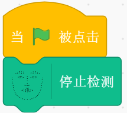
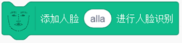
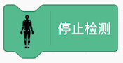

---
 

## 口罩人脸识别

  
### 口罩人脸识别
	包括是否戴口罩和未戴口罩人员进行人脸识别，该插件基于dlna设备发现功能去获取自配置的小狮网关IP。

-  `是否戴口罩` - 对人脸是否戴口罩进行检测
 	- 例如，是全体还是部分人员戴口罩
-  `人脸识别` - 对未戴口罩的刃进行人脸识别
 	- 例如，如果没有戴口罩，可以进行人脸识别
-   `人脸添加` - 将人脸添加到人脸库中
 	- 例如，将姓名“张三”和对应的人脸截图添加到人脸库中
 

### dlna设备发现说明  
	
	dlna可自动发现局域网内的小狮网关信息,加载人脸识别插件时，在弹框中显示所有扫描到的小狮网关信息。用户点击自己的小狮网关对应的IP即可获得对应机构的人脸库，获得人脸库之后可进行人脸操作。

#### dlna扫描发现

### 1. 打开摄像头
该积木块打开摄像头进行口罩人脸识别。

 

### 2. 手机IP摄像头
该积木块可以获得手机IP摄像头。

 

### 3. 电脑摄像头
该积木块可以获得电脑摄像头。

 

### 4. 进行口罩检测
点击积木块进行口罩检测，检测之前需要打开摄像头。 
	

 

### 5. 当识别到人脸数量戴口罩时
人脸数量包括全部，部分，无人，当检测结果对应到相应的人脸数量时，触发。

 

### 6. 检测到未戴口罩人脸
判断是否有未戴口罩的人，检测到有人没戴口罩，返回true。		

 

### 7. 对未戴口罩人员进行人脸识别
对没有戴口罩的人员进行人脸识别，返回识别到的结果。		

 

### 8. 口罩检测结果
口罩检测结果，包括“全体戴口罩”，“部分戴口罩”，“无人戴口罩”三种情况。		

 

### 9. 添加人脸
添加人脸，将人脸添加到人脸库中。		

 

### 10. 当识别到人脸
在进行对未戴口罩人员进行人脸识别时，若得到结果，则触发。		

 

### 11. 识别到的姓名
对未戴口罩人员进行人脸识别时，所获得的结果。		

 

#### 示例	
点击使用电脑摄像头，并添加人脸tom，点击绿棋开始口罩检测，当识别到无人戴口罩时，舞台角色说出口罩检测结果，如果检测到有未戴口罩人脸，对未戴口罩人员进行人脸识别。当识别到人脸时，说出识别到的姓名。

---
 

## 口罩检测

### 口罩检测介绍			
	
	通过口罩检测，判断口罩佩戴情况。

	
 

### 1. 打开摄像头
该积木块打开摄像头进行口罩检测。

 

### 2. 手机IP摄像头
该积木块可以获得手机IP摄像头。

 

### 3. 电脑摄像头
该积木块可以获得电脑摄像头。

 

### 4. 进行口罩检测		
点击积木块进行口罩检测，检测之前需要打开摄像头。	

 

### 5. 当识别到人脸数量戴口罩时
人脸数量包括全部，部分，无人，当检测结果对应到相应的人脸数量时，触发。

 

### 6. 检测到人员数量带口罩
根据选择人脸数量判断判断戴口罩情况，若情况符合返回true。		

 

### 7. 口罩检测结果
口罩检测结果，包括“全体戴口罩”，“部分戴口罩”，“无人戴口罩”三种情况。		

 

#### 示例

点击使用电脑摄像头，点击绿棋开始口罩检测，当识别到无人戴口罩时，舞台角色说出口罩检测结果为“无人戴口罩”。 	

---
 

## 人脸检测

  
### 人脸检测介绍
	检测年龄，性别，表情。
 

### 1. 人脸检测
使用小小创造家插件中视频侦测的摄像头，探测人脸的特征。 
	

 

### 2. 当检测完成
在进行人脸检测时，若得到结果，则触发。 
	

 

### 3. 检测到的年龄
显示识别到的年龄。		

 

### 4. 检测到的性别
显示识别到的性别。	
	

 

### 5. 检测到的表情
显示识别的表情结果。	
	

 

#### 示例	
开启视频侦测插件中的摄像头，点击绿旗开始检测人脸，当检测到人脸时，舞台角色说出已检测结果的年龄、性别和表情。 	

---
 

## 人脸搜索

  
### 人脸搜索介绍
	将人脸添加到人脸库中，并且进行人脸搜索。
 

### 1. 创建人脸组
创建用户群体组名，可以向群体中添加人脸，搜索人脸会在对应的用户群体中搜索。

 

### 2. 添加人脸到组		
向指定的用户群中添加人脸信息，使用时需将对应的人脸置于摄像机中心。

 

### 3. 在指定组中搜索人脸	
在指定群体中搜索此时摄像头中的人脸在该群体中最相似的人脸名字。	

 

### 4. 当搜索完成
当搜索请求完成时，触发。

 
	

### 5.搜索到的姓名 
识别到的用户姓名。 

 

#### 示例	
开启视频侦测插件中的摄像头，创建人脸组，添加人脸XiaoMing到组group_1,点击绿旗开始搜索人脸，当搜索到人脸时，舞台角色说出已检测的人脸姓名。 	

---
 

## 人脸关键点
  
### 人脸关键点介绍
    通过拖动积木块，实现人脸检测，得到情感置信度，人脸特征坐标，人脸相似度，通过添加人脸部数据，进行人脸识别	

### 积木块说明
### 1. 打开(关闭)摄像头
打开(关闭)摄像打开，进入插件摄像头自动打开。  
  
 

### 2. 视频透明度设置
可以设置视频的透明度，默认为50。  
  
 

### 3. 单人人脸检测
点击积木块可以进行单人的人脸检测。  
 
 
 
#### 示例   
点击小旗子运行积木块，进行人脸检测，所用模型是tiny模型，保证脸部所有特征位置出现在镜头中。   
  
 

### 4. 停止检测 
停止人脸检测。  

 
 
#### 示例  
点击小绿旗，停止人脸检测。    
 
 

### 5. 表情自信度
得到愤怒，厌恶，担心，快乐，中立，伤心，惊讶表情的自信度。  
 
  

#### 示例  
点击小绿旗，开启人脸检测，当人脸检测打开，发送消息1，当接受到消息1时，重复执行说出快乐自信度的值。   

 

### 6. 脸部特征的值
得到鼻尖,鼻根,下巴,左眼外角,左眼内角,右眼外角,右眼内角,嘴中心,嘴左角,嘴右角,左脸最外,右脸最外的X,Y坐标值
  
 

#### 示例 
点击小绿旗，开启人脸检测，当人脸检测打开，发送消息1，当接受到消息1时，重复执行说出脸部鼻尖的X坐标值。   

 

### 7. 人脸相似度
得到人脸相似度的值。   
  
 

#### 示例 
点击小绿旗，开启人脸检测，当人脸检测打开，发送消息1，当接受到消息1时，重复执行说出人脸相似度值。   

 

### 8. 添加人脸进行人脸识别
输入名称,添加带名称的数据到匹配组。  
  
 

### 9. 开始人脸识别 
对出现在摄像头的人脸进行人脸识别。   
 
 

### 10. 识别结果 
得到出现在摄像头的人脸名称。   

   

#### 示例  
点击添加人脸[alla]进行人脸识别积木块，添加完成后，点击小绿旗，开启人脸识别，当人脸识别打开，重复执行说出识别结果。   

 

### 11. 当时识别到 
当返回识别结果是被触发。   

   

#### 示例  
点击添加人脸[alla]进行人脸识别积木块，添加完成后，点击小绿旗，开启人脸识别，当识别到是alla时，说出识别结果。   

 

### 12. 多人人脸检测 
进行多人人脸检测。     
  
  

### 13. 多人检测数据 
获取多人检测数据。    
   
 

#### 示例  
点击小绿旗，开启多人人脸检测，当人脸检测打开，发送消息1，当接受到消息1时，重复执行说出多人检测数据。   

---  
 

## 语音识别

### 语音识别介绍			
	
	语音输入，语音识别。

	
 

### 1. 请入语音输入	

通过电脑麦克风输入语音，点击输入语音，可以选择语音输入的时间，默认输入时间为5秒。	

 

### 2. 当语音识别返回结果积木（含特定词语）		
当识别到语音中包含给定词语时执行，默认包含“开始”。

 

### 3. 当语音识别返回结果
当识别语音结束时执行。	

 

### 4. 语音识别结果积木		
输出输入的语音结果。	

 

#### 示例		
点击小旗子,当听到输入的语音中包含开始时，舞台中角色说出输入语音结果。	

---
 

## 文字朗读

### 文字朗读介绍			
	
	控制文字朗读的音色，音量，音高，速度。

	
 

### 1. 选择朗读人物	

选择不同的朗读人物(小燕，许久，小萍，许小宝，小婧)进行朗读。	

 

### 2. 朗读音量		
设置朗读音量，默认值为50。

 

### 3. 朗读音高
设置朗读音高，默认值为50。	

 

### 4. 朗读速度		
设置朗读音高，默认值为50。	

 

### 5. 朗读输入内容		
朗读输入文本，默认值为“你好呀”。	

 

#### 示例

点击小旗子，设置朗读人物为许小宝，朗读音量为50，朗读音高为50，朗读速度为50，朗读内容为”你好呀“。	

---
 

## 离线语音技术

### 离线语音技术介绍			
	
	支持离线唤醒和离线播报，播报支持多种人物音色。

	
 

### dlna设备发现说明  
	
	dlna可自动发现局域网内的小狮网关信息,加载人脸识别插件时，在弹框中显示所有扫描到的小狮网关信息。用户点击自己的小狮网关对应的IP即可获得对应机构的人脸库，获得人脸库之后可进行人脸操作。

#### dlna扫描发现

### 1. 当唤醒时	

对着小狮网关说出指定唤醒词，可触发积木块。	

 

### 2. tts人物		
可选择不同的人物(小燕，小峰，楠楠，小强，小蓉，小梅)来播报内容。

 

### 3. tts文字转语音
将输入的文本内容进行播报。	

 

#### 示例

对着小狮盒子说出唤醒词，客户端通过小燕的声音说出“你好呀”。	

---
 

## 身体姿态检测

### 身体姿态检测介绍			
	
	支持离线唤醒和离线播报，播报支持多种人物音色。

	
 

### 1. 打开(关闭)摄像头
打开(关闭)摄像打开，进入插件摄像头自动打开。  
  
 

### 2. 视频透明度设置
可以设置视频的透明度，默认为50。  
  
 

### 3. 身体姿态检测(单人)
点击积木块可以进行单人的身体姿态检测。  
 
 

### 4. 停止检测 
停止身体姿态检测。  

 

### 5. 身体关键点的X，Y值 
获得身体关键点(鼻子，左眼，右眼，左耳，右耳，左肩，右键，左手肘，右手肘，左手腕，右手腕，左臀，右臀，左膝，右膝，左脚踝，右脚踝)。  

 

#### 示例   
点击身体姿态检测(单人)，等到弹出检测成功小框后，点击小绿旗，重复执行10次，说出身体关键点鼻子的X值，然后停止检测。   
  
 

### 6. 身体姿态检测(多人)
点击积木块可以进行多人的身体姿态检测。  

 

### 7. 多人检测数据 
获得多人身体检测的数据结果。  

 

#### 示例   
点击身体姿态检测(多人)，等到弹出检测成功小框后，点击小绿旗，重复执行10次，说出多人检测数据，然后停止检测。   
  

---
 

## 图像识别

### 图像识别介绍			
	
	该插件可以对摄像头的传入的图像进行类别识别。
	
 

### 1. 电脑摄像头
该积木块与使用摄像头积木块一起使用，可使用电脑摄像头进行图像智能识别。

 

### 2. 手机IP摄像头
该积木块与用摄像头积木块一起使用，可使用手机IP摄像头进行图像智能识别。
	

 

### 3.使用摄像头		
选择不同的摄像头输入，进行图像智能识别。

 

### 4. 图像识别 类别		
对图像进行分类识别，可支持识别种类有：主体，场景。

 

### 5. 当识别完成积木块
当图像识别请求完成时，触发。

 

### 6. 图像识别结果积木块
调用图像识别积木块请求完成后返回的图像识别结果。

 

#### 示例	
当绿旗被点击，会打开并使用电脑摄像头进行图像识别，将要识别的物体放到电脑摄像头前，舞台角色说出识别结果。	

---
 

## 文字识别

### 文字识别介绍			
	
	该插件可以对不同摄像头的传入的图像进行文字识别。
	
 

### 1. 电脑摄像头	
该积木块与使用摄像头积木块一起使用，可使用电脑摄像头进行文字识别。

 

### 2. IP摄像头积木块
该积木块与使用摄像头积木块一起使用，可使用手机IP摄像头进行文字识别。
	

 

### 3.选择摄像头积木块		
选择不同的摄像头输入，进行文字识别。

 

### 4. 文字识别类型
对图像内的文字信息进行识别，可支持识别种类有：通用文字，手写字。

 

### 5. 卡牌文字识别
对卡牌文字信息进行识别，可支持识别种类有：车牌。

 

### 6. 当识别完成积木块
当图像识别请求完成时，触发。

 

### 7. 文字识别结果		
调用文字识别积木块请求完成后返回的文字识别结果。

 

### 7. 卡牌文字识别结果		
调用卡牌识别积木块请求完成后返回的卡牌文字识别结果。

 

#### 示例	
当绿旗被点击，会打开并使用电脑摄像头循环进行文字识别，将要识别的物体放到电脑摄像头前，当识别完成时，舞台角色说出识别结果。	

---
 

## 手势识别

### 手势识别介绍			
	
	该插件可以对不同摄像头的传入的图像进行手势识别。
	
 

### 1. 电脑摄像头	
该积木块与使用摄像头积木块一起使用，可使用电脑摄像头进行手势识别。

 

### 2. IP摄像头积木块
该积木块与使用摄像头积木块一起使用，可使用手机IP摄像头进行手势识别。
	

 

### 3. 选择摄像头积木块		
选择不同的摄像头输入，进行手势识别。

 

### 4. 手势识别
对图像内的手势进行识别。

 

### 5. 当识别完成积木块
当手势识别请求完成时，触发。

 

### 6. 手势识别结果		
调用手势识别积木块请求完成后返回的手势识别结果。

 

#### 示例	
当绿旗被点击，会打开并使用电脑摄像头循环进行手势识别，当识别到“ok”手势时，语音播报“OK”。。	

---
 

## 图像分类

### 图像分类介绍			
	
	该插件可以对图像进行学习，分类。
	
 

### 1. 打开图像窗口	
点击打开图像窗口，打开训练窗口。可修改分类名称，来确定分类名。通过点击学习按钮，训练该分类，将信心值训练到100%，多换几个位置，确保数据的正确性。 

   

 

### 2. 背景信心
获得指定分类信心值。

 

### 3. 识别结果		
信心值最大的分类为识别结果。

 

### 4. 判断识别结果
判断识别结果是否为指定分类，若是，返回true。

 

#### 示例	
当绿旗被点击，会打开并使用电脑摄像头循环进行手势识别，当识别到“ok”手势时，语音播报“OK”。。	

---
 

## 身体姿态分类

### 身体姿态分类介绍			
	
	该插件可以对图像进行学习，分类。
	
 

### 1. 打开身体姿态窗口	
点击打开图像窗口，打开训练窗口。可修改分类名称，来确定分类名。通过点击学习按钮，训练该分类，将信心值训练到100%，多换几个位置，确保数据的正确性。 

    

 

### 2. 背景信心
获得指定分类信心值。

 

### 3. 识别结果		
信心值最大的分类为识别结果。

 

### 4. 判断识别结果
判断识别结果是否为指定分类，若是，返回true。

 

#### 示例	
当绿旗被点击，会打开并使用电脑摄像头循环进行手势识别，当识别到“ok”手势时，语音播报“OK”。。	

---
 

## 声音分类

### 声音分类介绍			
	
	该插件可以对图像进行学习，分类。
	
 

### 1. 打开声音窗口	
点击打开声音分类窗口，打开训练窗口。添加要训练的分类。通过点击分类名添加声音样本，每个分类的样本不能少于4个，分类样本收集完后，点击转移学习，转移学习完成后，点击开始识别。 

   

 

### 2. 背景信心
获得指定分类信心值。

 

### 3. 识别结果		
信心值最大的分类为识别结果。

 

### 4. 判断识别结果
判断识别结果是否为指定分类，若是，返回true。

 

#### 示例	
当绿旗被点击，会打开并使用电脑摄像头循环进行手势识别，当识别到“ok”手势时，语音播报“OK”。	

<!-- ## 百度人脸识别

### 百度人脸识别介绍			
	
	使用百度在线API,进行人脸检测和识别,使用前需使用视频侦测插件打开摄像头。

	
 

### 1. 人脸检测积木块	
使用该积木块可以检测舞台上的显示的人脸的特征，包括表情，性别，年龄。

 

### 2. 当检测完成积木块
当检测人脸请求返回时，触发。	

 

### 3.年龄积木块		
检测到的年龄信息。

 

### 4. 性别积木块		
检测到的性别信息。

 

### 5. 表情积木块
检测到的表情信息。

 

### 6. 创建用户组积木块
创建用户群体群名，可以向群体中添加人脸，搜索人脸会在对应的用户群体中搜索。

 

### 7. 添加人脸积木块		
向指定的用户群中添加人脸信息，使用时需将对应的人脸置于摄像机中心。

 

### 8. 搜索人脸积木块		
在指定群体中搜索此时摄像头中的人脸在该群体中最相似的人脸名字，如果置信度小于70%，将不会返回信息。	

 

### 9. 当识别到积木块
当搜索请求完成时，触发。

 

### 10. 姓名积木块
识别到的用户姓名

#### 示例	
开启摄像头并循环进行人脸检测，当检测到人脸时，说出检测到的年龄，性别，表情并进行人脸搜索，当识别到人脸时，说出人脸对应的名字。

---

  -->

<!-- ## 智能识别

### 智能识别介绍			
	
	该插件可以对不同摄像头的传入的图像进行类别识别，人体识别，文字识别，及对传入的人脸进行动漫化处理。
	
 

### 1. 电脑摄像头积木块	
该积木块与选择积木块一起使用，可使用电脑摄像头进行图像智能识别。

 

### 2. IP摄像头积木块
该积木块与选择积木块一起使用，可使用手机IP摄像头进行图像智能识别。
	

 

### 3.选择摄像头积木块		
选择不同的摄像头输入，进行图像智能识别。

 

### 4. 图像识别积木块		
对图像进行分类识别，可支持识别种类有：主体，蔬菜，动物，植物，车型，车辆侦测，菜品等。

 

### 5. 图像识别结果积木块
调用图像识别积木块请求完成后返回的图像识别结果。

 

### 6. 文字识别积木块
对图像内的文字信息进行识别，可支持识别种类有：通用文字，手写字，印刷文字等。

 

### 7. 文字识别结果积木块		
调用文字识别积木块请求完成后返回的文字识别结果。

 

### 8. 人体识别积木块		
对图像内的人体进行识别，返回人体信息，可支持识别种类有：人体关键点识别，手势识别等。

 

### 9. 人体识别结果积木块
调用人体识别积木块请求完成后返回的人体识别结果。

 

### 10. 当识别完成积木块
当图像识别请求完成时，触发。

 

### 11. 人脸动漫化积木块
对图像内的人的头像进行动漫化处理，将处理后的图像返回到舞台上。

#### 示例	
当绿旗被点击，会打开并使用电脑摄像头循环进行手势识别，当识别到“ok”手势时，语音播报“OK”,当识别到“拳头”时，语音播报“握紧拳头”。	

		
---  

## 身体姿态检测
  
### 身体姿态检测介绍
    通过拖动积木块，实现身体姿态检测，得到身体关键点的坐标，同时还能进行多人检测	

### 积木块说明
### 1. 打开(关闭)摄像头
打开(关闭)摄像打开，进入插件摄像头自动打开。  
  

### 2. 视频透明度设置
可以设置视频的透明度，默认为50。  
  

### 3. 身体姿态检测(单人)
点击积木块可以进行单人的身体姿态检测检测。  
 
 
### 样例代码   
点击小旗子运行积木块，进行身体姿态检测，身体部位的特征点出现在镜头中。   
  

### 4. 停止检测 
停止身体姿态检测。  

 
### 样例代码  
点击空格，停止身体姿态检测。    
 

### 5. 身体关键点的值
鼻子,左眼，右眼,左耳,右耳,左肩,右肩,左手肘,右手肘,左手腕,右手腕,左臀,右臀,左膝,右膝,左脚踝,右脚踝的x,y值。    
  

### 样例代码  
点击小绿旗，开启身体姿态检测，当检测开始，发送消息1，当接受到消息1时，重复执行说出鼻子x轴。   

### 6. 身体姿态检测(多人) 
进行多人身体姿态检测。     
   

### 7. 多人检测数据 
获取多人检测数据。    
   

### 样例代码  
点击小绿旗，开启多人身体姿态检测，当检测打开，发送消息1，当接受到消息1时，重复执行说出多人检测数据。   
 -->

