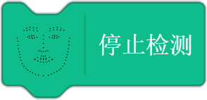

# 人工智能
## 人脸检测
 

功能：使用视频侦测模块中的开启摄像头指令，打开电脑摄像头，检测人脸的特征。

功能：当人脸检测完成后，触发对应事件。

功能：判断是否检测到人脸，检测到返回值为true，未检测到返回值为false。

功能：通过人脸检测，可以检测到年龄、性别、表情特征。 

参考案例说明：点击绿旗，人脸检测完成后，小度音箱播报检测到的年龄。

## 人脸搜索

 

功能：首先创建一个人脸组，为添加人脸到组做准备。 人脸组的名称可以自己定义，相同名称的人脸组只需要新建一次。

功能：将人脸添加到提前建好的人脸组中，确保摄像头打开，并正对摄像头。第一个参数填写添加的人脸对应的姓名。第二个参数填写组名。在人脸组中添加过的人脸会被保存。

功能：在对应的人脸组里搜索摄像头前的人脸，确保摄像头打开，并正对摄像头 。

功能:当人脸搜索完成后，执行对应的事件。  

功能：返回人脸搜索后得到的姓名。

参考案例说明：点击绿旗后，在group_1组中搜索人脸，当搜索完成后，如果搜索到的姓名等于自己的名字，小度音箱播报：欢迎回家。

## 人脸关键点

 

功能：启动人脸关键点检测功能，确保摄像头打开，人脸位于摄像头前。

功能：停止人脸关键点检测功能，舞台区人脸关键点会消失。

 

功能：置信度，获取当前人脸最可能的表情可信度。

功能：获取鼻尖,鼻根,下巴,左眼外角,左眼内角,右眼外角,右眼内角,嘴中心,嘴左角,嘴右角,左脸最外,右脸最外的X,Y坐标值。  

功能：判断人脸表情。

功能：获取人脸表情值结果。

功能：获取当前检测是人脸的可能性。

参考案例说明：人脸关键点检测完成后，实现角色跟随鼻尖上下移动。

参考案例说明：人脸关键点检测完成后，利用检测到的表情值做判断，当表情值是愤怒时，小度音箱播报：笑一笑，十年少。

## 语音识别

 

功能： 需要语音输入时使用，参数输入时长可以根据情况更改。

功能：当识别任意语音后，执行对应的事件。

功能： 当识别到规定的语音后，执行对应的事件。

功能：获取语音识别的结果。

 

参考案例说明：点击绿旗后，语音输入：转起来，输入时间为3秒。当识别到正确的内容后，角色右转一圈。

## 口罩检测

 

功能：选择摄像头。 

功能：使用手机摄像头。

功能：使用电脑摄像头。

功能：进行口罩检测，检测前需要确保摄像头打开。

功能：口罩检测完成后，识别到对应的戴口罩人数时，触发事件。可选的参数有：全体戴口罩、部分戴口罩、无人戴口罩。

功能：口罩检测完成后，用来判断当前戴口罩的人数，可选的参数有：全体戴口罩、部分戴口罩、无人戴口罩。

功能：获取口罩检测的结果，可能的结果有：全体戴口罩、部分戴口罩、无人戴口罩。

功能：获取口罩检测时的人脸个数。

 

参考案例说明：点击绿旗后，进行口罩检测，当检测结果为全体戴口罩时，显示“全体戴口罩”。

## 文字识别

 

功能：选择摄像头。

功能：选择电脑摄像头。 

功能：选择手机摄像头。

功能：进行文字识别，注意需要打开摄像头镜像模式，才能识别出正确的结果。

功能：进行车牌识别，需使用真实的车牌或车牌图片进行识别 。

功能：当文字识别或车牌识别完成后，触发对应的事件。

功能：获取文字识别的结果。

功能： 获取车牌识别的结果。

参考案例说明：点击绿旗后，使用电脑摄像头进行文字识别，当文字识别完成后，如果识别的结果为cat，那么播放cat音效。

## 手势识别

 

功能：选择摄像头。

功能：选择电脑摄像头。

功能：选择手机摄像头。

功能：进行手势识别，确保摄像头打开。

功能：获取手势识别的结果。

功能：当手势识别完成后，触发对应的事件。

参考案例说明：点击绿旗后，使用电脑摄像头进行手势识别，识别完成后，判断如果是ok的手势，LED彩光灯打开。

## 图像分类

 

功能：点击打开图像窗口学习背景和物品。

功能：点击"学习"采集背景以及物品的样本，每个分类采集的样本数量越多，结果越准确。名称分类1可修改成物品的名称。

功能：机器学习完毕后使用，存储当前摄像头前是某个物品或背景的置信度值。

功能：用来判断识别结果是否为背景或某个物体，条件成立返回true，不成立返回false。

功能：存放机器学习后，当前识别到的背景或物体的名称。

参考案例说明：机器学习兔子的外观，并进入识别。当点击“绿旗”后，语音输入“rabbit”，如果当前机器学习后识别的结果为小兔子，播放胜利音效。

## 图像识别pro
 

功能：添加图像识别模块，并连接小狮盒子。

 

功能：通过电脑摄像头采集图片。

 

功能：通过手机摄像头采集图片。

 

功能：选择手机或者电脑进行图像采集。

 

功能：点击进行图像识别，可以选择的识别类别有：垃圾分类、动物分类、动漫人像分类、水果分类

 

功能：图像识别完成后执行对应的事件

 

功能：点击显示图像识别的结果

 

 

案例说明：点击绿旗后，再按下空格键进行图像识别，识别完成后，舞台上的角色会将识别结果说出。

