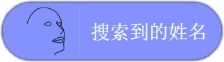
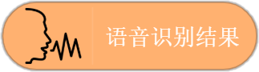

## 人脸检测

|指令     |    功能 |
| --- | --- |
|     |  使用视频侦测模块中的开启摄像头指令，打开电脑摄像头，检测人脸的特征。   |
|     | 当人脸检测完成后，触发对应事件。    |
|     |   判断是否检测到人脸，检测到返回值为true，未检测到返回值为false。  |
|     |   通过人脸检测，可以检测到年龄、性别、表情特征。  |

|参考程序 |    说明 |
| --- | --- |
|    |  
点击绿旗，人脸检测完成后，小度音箱播报检测到的年龄。 
 |

## 人脸搜索
|指令     |    功能 |
| --- | --- |
|   |  首先创建一个人脸组，为添加人脸到组做准备。 人脸组的名称可以自己定义，相同名称的人脸组只需要新建一次。  |
|   | 将人脸添加到提前建好的人脸组中，确保摄像头打开，并正对摄像头。第一个参数填写添加的人脸对应的姓名。第二个参数填写组名。在人脸组中添加过的人脸会被保存。    |
|    |  在对应的人脸组里搜索摄像头前的人脸，确保摄像头打开，并正对摄像头 。 |
|    |   当人脸搜索完成后，执行对应的事件。  |
| |   返回人脸搜索后得到的姓名。  |

|参考程序 |    说明 |
| --- | --- |
|  |  
点击绿旗后，在group_1组中搜索人脸，当搜索完成后，如果搜索到的姓名等于自己的名字，小度音箱播报：欢迎回家。 
 |

## 人脸关键点
|指令     |    功能 |
| --- | --- |
| |    启动人脸关键点检测功能，确保摄像头打开，人脸位于摄像头前。|
| |   停止人脸关键点检测功能，舞台区人脸关键点会消失。 |
||置信度，获取当前人脸最可能的表情可信度。
| | 获取鼻尖,鼻根,下巴,左眼外角,左眼内角,右眼外角,右眼内角,嘴中心,嘴左角,嘴右角,左脸最外,右脸最外的X,Y坐标值。   |
||  判断人脸表情。  |
||  获取人脸表情值结果。  |
  ||   获取当前检测是人脸的可能性。 |
  
  |参考程序 |    说明 |
| --- | --- |
||  
人脸关键点检测完成后，实现角色跟随鼻尖上下移动。 
 |
||  
人脸关键点检测完成后，利用检测到的表情值做判断，当表情值是愤怒时，小度音箱播报：笑一笑，十年少。 
 |
  
  ## 语音识别
  |指令     |    功能 |
| --- | --- |
|  |  需要语音输入时使用，参数输入时长可以根据情况更改。 |
| | 当识别任意语音后，执行对应的事件。  |
|  |  当识别到规定的语音后，执行对应的事件。 |
|  |  获取语音识别的结果。 |

 |参考程序 |    说明 |
| --- | --- |
||  
点击绿旗后，语音输入：转起来，输入时间为3秒。当识别到正确的内容后，角色右转一圈。 
 |

## 口罩检测
  |指令     |    功能 |
| --- | --- |
| |  选择摄像头。 |
| | 使用手机摄像头。 |
|  |  使用电脑摄像头。 |
|  | 进行口罩检测，检测前需要确保摄像头打开。  |
| |  口罩检测完成后，识别到对应的戴口罩人数时，触发事件。可选的参数有：全体戴口罩、部分戴口罩、无人戴口罩。 |
| | 口罩检测完成后，用来判断当前戴口罩的人数，可选的参数有：全体戴口罩、部分戴口罩、无人戴口罩。  |
| |  获取口罩检测的结果，可能的结果有：全体戴口罩、部分戴口罩、无人戴口罩。 |
| |获取口罩检测时的人脸个数。   |

 |参考程序 |    说明 |
| --- | --- |
||  
点击绿旗后，进行口罩检测，当检测结果为全体戴口罩时，显示“全体戴口罩”。 
 |

## 文字识别
|指令     |    功能 |
| --- | --- |
||  选择摄像头。 |
||  选择电脑摄像头。 |
||  选择手机摄像头。 |
||  进行文字识别，注意需要打开摄像头镜像模式，才能识别出正确的结果。 |
||进行车牌识别，需使用真实的车牌或车牌图片进行识别 。  |
||   当文字识别或车牌识别完成后，触发对应的事件。|
|| 获取文字识别的结果。  |
||   获取车牌识别的结果。|

 |参考程序 |    说明 |
| --- | --- |
||  
点击绿旗后，使用电脑摄像头进行文字识别，当文字识别完成后，如果识别的结果为cat，那么播放cat音效。
 |

## 手势识别
|指令     |    功能 |
| --- | --- |
||  选择摄像头。 |
||  选择电脑摄像头。 |
||  选择手机摄像头。
||进行手势识别，确保摄像头打开。  |
|| 获取手势识别的结果。 |
|| 当手势识别完成后，触发对应的事件。 |

 |参考程序 |    说明 |
| --- | --- |
||  
点击绿旗后，使用电脑摄像头进行手势识别，识别完成后，判断如果是ok的手势，LED彩光灯打开。
 |

## 图像分类
