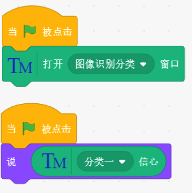
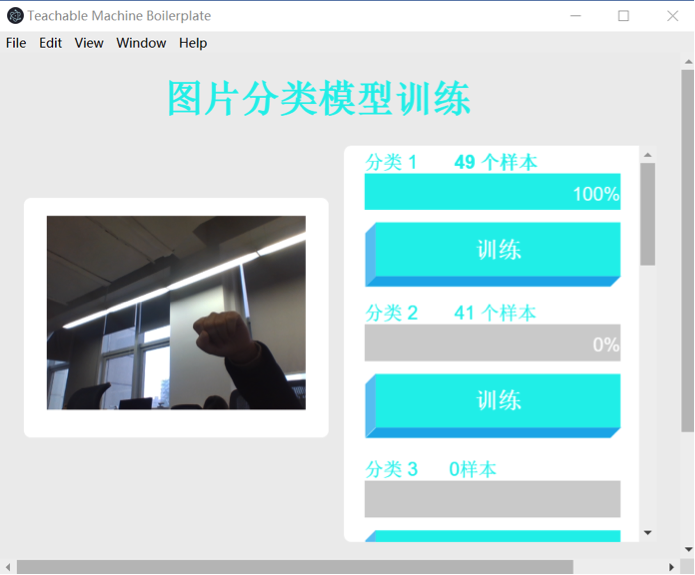
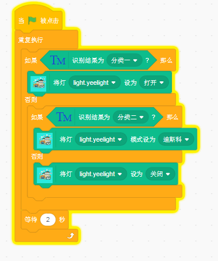
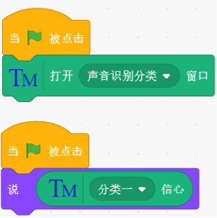

---
 

## 人脸识别

  
### 人脸识别介绍
	包括人脸检测和人脸识别，该插件基于dlna设备发现功能去获取自配置的小狮网关IP。

- `人脸检测` - 对有没有人脸，以及人脸基本特征进行检测
 	- 基本特征包括：年龄、性别、微笑度
-  `人脸识别` - 对检测出来的人脸匹配是否是已知的某个人
 	- 例如，匹配上是自己家人，或者不是自己家人
-	`人脸添加` - 将人脸添加到人脸库中
 	- 例如，将姓名“张三”和对应的人脸截图添加到人脸库中
 

### dlna设备发现说明  
	
	dlna可自动发现局域网内的小狮网关信息,加载人脸识别插件时，在弹框中显示所有扫描到的小狮网关信息。用户点击自己的小狮网关对应的IP即可获得对应机构的人脸库，获得人脸库之后可进行人脸操作。

#### dlna扫描发现

### 1. 打开IP相机积木
该积木块打开检测识别弹框窗口进行人脸识别和检测。

 

### 2. 打开IP相机添加人脸积木
该积木块打开人脸添加窗口，可进行添加人脸到人脸库操作。

 

### 3. 开始人脸检测积木
使用手机的ipwebcamera摄像头对应的ip进行人脸探测，探测人脸的特征，检测人脸之前需要打开检测识别弹框窗口。 
	

 

### 4. 当检测到人脸积木
当摄像头探测到人脸时，触发。

 

### 5. 人脸检测年龄积木
显示识别到的年龄。		

 

### 6. 人脸检测性别积木
显示识别到的性别。	
	

 

### 7. 人脸检测微笑度积木
显示识别的微笑度百分比结果。	
	

 

### 8. 开始人脸识别积木
使用手机的ipwebcamera摄像头对应的ip进行人脸识别，识别人脸姓名，识别人脸之前需要打开检测识别弹框窗口。  
	

 

### 9. 当识别到人脸积木
当摄像头识别到人脸结果时，触发。  

 

### 10. 人脸姓名积木
显示识别到的人脸对应姓名。

 

#### 示例	
使用手机摄像头开始检测人脸，当检测到人脸时，舞台角色说出已检测结果的年龄、性别和微笑度；当检测到是男性时，说出“这是一名男性”；并进行人脸识别，当人脸识别异步返回结果时，将识别的姓名说出。 	

---
 

## 语音识别

### 语音识别介绍			
	
	语音识别，文字播报。

	
 

### 1. 打开语音输入积木	

通过电脑麦克风输入语音，点击输入语音，可以选择语音输入的时间，默认输入时间为5秒	

 

### 2. 当语音识别返回结果积木
当识别语音结束时执行	

 

### 3. 当语音识别返回结果积木（含特定词语）		
当识别到语音中包含给定词语时执行，默认包含“开始”

 

### 4. 语音识别结果积木		
输出输入的语音结果。	

 

#### 示例

点击小旗子，输入语音5秒，文字输出语音输入的结果。	

 

### 5. 选择人物声线积木
可以选择不同播报人物声线。

 

### 6. 讲话积木
将选框内文字以语音输出，通过电脑麦克风播报出来

 

#### 示例		
点击小旗子，用小宇的声线说出“你好呀”。	

---
 

## 百度人脸识别

### 百度人脸识别介绍			
	
	使用百度在线API,进行人脸检测和识别,使用前需使用视频侦测插件打开摄像头。

	
 

### 1. 人脸检测积木块	
使用该积木块可以检测舞台上的显示的人脸的特征，包括表情，性别，年龄。

 

### 2. 当检测完成积木块
当检测人脸请求返回时，触发。	

 

### 3.年龄积木块		
检测到的年龄信息。

 

### 4. 性别积木块		
检测到的性别信息。

 

### 5. 表情积木块
检测到的表情信息。

 

### 6. 创建用户组积木块
创建用户群体群名，可以向群体中添加人脸，搜索人脸会在对应的用户群体中搜索。

 

### 7. 添加人脸积木块		
向指定的用户群中添加人脸信息，使用时需将对应的人脸置于摄像机中心。

 

### 8. 搜索人脸积木块		
在指定群体中搜索此时摄像头中的人脸在该群体中最相似的人脸名字，如果置信度小于70%，将不会返回信息。	

 

### 9. 当识别到积木块
当搜索请求完成时，触发。

 

### 10. 姓名积木块
识别到的用户姓名

#### 示例	
开启摄像头并循环进行人脸检测，当检测到人脸时，说出检测到的年龄，性别，表情并进行人脸搜索，当识别到人脸时，说出人脸对应的名字。

---

 

## 机器学习

 

### 机器学习介绍			
	
	简单而强大的机器学习模型，快速学习三种类别的分类，并进行识别。
	- 图像
	- 声音
	- 骨骼（身体姿态）
	
 

### 1. 图像分类积木	
打开图像分类窗口	

	
 

#### 示例		
打开图像识别分类窗口，点击训练按钮，对不同分类进行训练，点击小旗子，说出分类一的信心值。例如，训练一个拳头，拳头的大部分角度训练达到100%，训练完成。	

	

	
 

另外，训练手势识别开灯的编程示例如下。		

 

### 2. 身体姿态分类积木		
打开身体姿态分类窗口	

	
 

#### 示例		
打开身体姿势分类窗口，点击分类一训练按钮，训练到分类一信心值为100%，
训练完成。对其他分类进行相同的训练操作，点击小旗子，说出分类一的信心值。	

	

 

### 3. 声音分类积木		
打开声音识别分类窗口

 

#### 示例		
打开声音识别分类窗口，其中训练分类1采集背景音，至少采集四次，采集完背景音后可以开始训练其他分类。	

	

点击“开始转移学习”按钮，转移学习完成后，点击“开始”按钮。

	
点击小旗子，说出分类一的信心值。

 

### 4. 识别结果积木
返回识别结果分类。	

 

#### 示例	
打开识别分类窗口，进行训练，说出识别结果。

	
 

### 5. 判断识别结果积木	
判断识别结果是否为选区内分类。

	
 

#### 示例		
打开识别分类窗口，进行训练，判断识别结果是否是分类一，若是，则说“是分类一啊”。

	

---
 

## 智能识别

### 智能识别介绍			
	
	该插件可以对不同摄像头的传入的图像进行类别识别，人体识别，文字识别，及对传入的人脸进行动漫化处理。
	
 

### 1. 电脑摄像头积木块	
该积木块与选择积木块一起使用，可使用电脑摄像头进行图像智能识别。

 

### 2. IP摄像头积木块
该积木块与选择积木块一起使用，可使用手机IP摄像头进行图像智能识别。
	

 

### 3.选择摄像头积木块		
选择不同的摄像头输入，进行图像智能识别。

 

### 4. 图像识别积木块		
对图像进行分类识别，可支持识别种类有：主体，蔬菜，动物，植物，车型，车辆侦测，菜品等。

 

### 5. 图像识别结果积木块
调用图像识别积木块请求完成后返回的图像识别结果。

 

### 6. 文字识别积木块
对图像内的文字信息进行识别，可支持识别种类有：通用文字，手写字，印刷文字等。

 

### 7. 文字识别结果积木块		
调用文字识别积木块请求完成后返回的文字识别结果。

 

### 8. 人体识别积木块		
对图像内的人体进行识别，返回人体信息，可支持识别种类有：人体关键点识别，手势识别等。

 

### 9. 人体识别结果积木块
调用人体识别积木块请求完成后返回的人体识别结果。

 

### 10. 当识别完成积木块
当图像识别请求完成时，触发。

 

### 11. 人脸动漫化积木块
对图像内的人的头像进行动漫化处理，将处理后的图像返回到舞台上。

#### 示例	
当绿旗被点击，会打开并使用电脑摄像头循环进行手势识别，当识别到“ok”手势时，语音播报“OK”,当识别到“拳头”时，语音播报“握紧拳头”。	

		
---  

## 人脸关键点
  
### 人脸关键点介绍
    通过拖动积木块，实现人脸检测，得到情感置信度，人脸特征坐标，人脸相似度，通过添加人脸部数据，进行人脸识别	

### 积木块说明
### 1. 打开(关闭)摄像头
打开(关闭)摄像打开，进入插件摄像头自动打开。  
  

### 2. 视频透明度设置
可以设置视频的透明度，默认为50。  
  

### 3. 单人人脸检测
点击积木块可以进行单人的人脸检测。  
 
 
### 样例代码   
点击小旗子运行积木块，进行人脸检测，所用模型是tiny模型，保证脸部所有特征位置出现在镜头中。   
  

### 4. 停止检测 
停止人脸检测。  

 
### 样例代码  
点击小绿旗，停止人脸检测。    
 

### 5. 表情自信度
得到愤怒，厌恶，担心，快乐，中立，伤心，惊讶表情的自信度。  
  

### 样例代码  
点击小绿旗，开启人脸检测，当人脸检测打开，发送消息1，当接受到消息1时，重复执行说出快乐自信度的值。   

### 6. 脸部特征的值
得到鼻尖,鼻根,下巴,左眼外角,左眼内角,右眼外角,右眼内角,嘴中心,嘴左角,嘴右角,左脸最外,右脸最外的X,Y坐标值
  

### 样例代码  
点击小绿旗，开启人脸检测，当人脸检测打开，发送消息1，当接受到消息1时，重复执行说出脸部鼻尖的X坐标值。   

### 7. 人脸相似度
得到人脸相似度的值。   
  

### 样例代码  
点击小绿旗，开启人脸检测，当人脸检测打开，发送消息1，当接受到消息1时，重复执行说出人脸相似度值。   

### 8. 添加人脸进行人脸识别
输入名称,添加带名称的数据到匹配组。  
  

### 9. 开始人脸识别 
对出现在摄像头的人脸进行人脸识别。   
 

### 10. 识别结果 
得到出现在摄像头的人脸名称。   
  

### 样例代码  
点击添加人脸[alla]进行人脸识别积木块，添加完成后，点击小绿旗，开启人脸识别，当人脸识别打开，重复执行说出识别结果。   

### 11. 当时识别到 
当返回识别结果是被触发。   
  

### 样例代码  
点击添加人脸[alla]进行人脸识别积木块，添加完成后，点击小绿旗，开启人脸识别，当识别到是alla时，说出识别结果。   

### 12. 多人人脸检测 
进行多人人脸检测。     
   

### 13. 多人检测数据 
获取多人检测数据。    
   

### 样例代码  
点击小绿旗，开启多人人脸检测，当人脸检测打开，发送消息1，当接受到消息1时，重复执行说出多人检测数据。   

---  

## 身体姿态检测
  
### 人脸关键点介绍
    通过拖动积木块，实现人脸检测，得到情感置信度，人脸特征坐标，人脸相似度，通过添加人脸部数据，进行人脸识别	

### 积木块说明
### 1. 打开(关闭)摄像头
打开(关闭)摄像打开，进入插件摄像头自动打开。  
  

### 2. 视频透明度设置
可以设置视频的透明度，默认为50。  
  

### 3. 单人人脸检测
点击积木块可以进行单人的人脸检测。  
 
 
### 样例代码   
点击小旗子运行积木块，进行人脸检测，所用模型是tiny模型，保证脸部所有特征位置出现在镜头中。   
  

### 4. 停止检测 
停止人脸检测。  

 
### 样例代码  
点击小绿旗，停止人脸检测。    
 

### 5. 表情自信度
得到愤怒，厌恶，担心，快乐，中立，伤心，惊讶表情的自信度。  
  

### 样例代码  
点击小绿旗，开启人脸检测，当人脸检测打开，发送消息1，当接受到消息1时，重复执行说出快乐自信度的值。   

### 6. 脸部特征的值
得到鼻尖,鼻根,下巴,左眼外角,左眼内角,右眼外角,右眼内角,嘴中心,嘴左角,嘴右角,左脸最外,右脸最外的X,Y坐标值
  

### 样例代码  
点击小绿旗，开启人脸检测，当人脸检测打开，发送消息1，当接受到消息1时，重复执行说出脸部鼻尖的X坐标值。   

### 7. 人脸相似度
得到人脸相似度的值。   
  

### 样例代码  
点击小绿旗，开启人脸检测，当人脸检测打开，发送消息1，当接受到消息1时，重复执行说出人脸相似度值。   

### 8. 添加人脸进行人脸识别
输入名称,添加带名称的数据到匹配组。  
  

### 9. 开始人脸识别 
对出现在摄像头的人脸进行人脸识别。   
 

### 10. 识别结果 
得到出现在摄像头的人脸名称。   
  

### 样例代码  
点击添加人脸[alla]进行人脸识别积木块，添加完成后，点击小绿旗，开启人脸识别，当人脸识别打开，重复执行说出识别结果。   

### 11. 当时识别到 
当返回识别结果是被触发。   
  

### 样例代码  
点击添加人脸[alla]进行人脸识别积木块，添加完成后，点击小绿旗，开启人脸识别，当识别到是alla时，说出识别结果。   

### 12. 多人人脸检测 
进行多人人脸检测。     
   

### 13. 多人检测数据 
获取多人检测数据。    
   

### 样例代码  
点击小绿旗，开启多人人脸检测，当人脸检测打开，发送消息1，当接受到消息1时，重复执行说出多人检测数据。   

