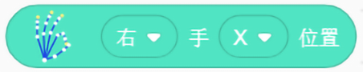
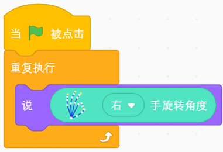

## 手势姿态跟踪

### 手势姿态跟踪介绍
	手势姿态跟踪包括对手，手指，手势的跟踪和识别    

### 硬件说明

体感控制器 
   

	
	使用包装盒中随附的USB电缆。控制器的光亮面朝上，绿灯面向您。下载所需的核心软件。

### 积木块说明
### 1. 手的位置
点击积木块，获得左手(右手)的X(Y和Z)的位置。

### 样例代码  
将积木块放入重复执行积木块，点击小旗子运行。舞台的小狮子会不停的“说”右手的X位置。  

### 2. 手旋转角度
点击积木块，获得左手(右手)的旋转角度。

### 样例代码  
将积木块放入重复执行积木块，点击小旗子运行。舞台的小狮子会不停的“说”右手的旋转角度。      

### 3. 手腕上下摆动角度
点击积木块，获得左手(右手)的手腕的上下摆动角度，朝上角度为正，朝下角度为负。

### 样例代码  
将积木块放入重复执行积木块，点击小旗子运行。舞台的小狮子会不停的“说”右手手腕摆动的角度。 

### 4. 手腕上下摆动角度
点击积木块，获得左手(右手)的食指(拇指，中指，无名指，小拇指)的X(Y,Z)的位置。

### 样例代码  
将积木块放入重复执行积木块，点击小旗子运行。舞台的小狮子会不停的“说”右手食指X的位置。 

### 5. 判断手势
点击积木块，当识别到指定手势(挥手，手指画圆，点击屏幕，点击键盘)时，返回。  

### 样例代码  
当识别出挥手的手势时，舞台的小狮子会说“你好”。

		

---  
## 人机交互键鼠
  
### 人机交互键鼠介绍 
	可自由的控制鼠标和键盘，进行人机交互
- `鼠标` - 对鼠标移动的位置，鼠标点击的方式进行控制
- `键盘` - 对键盘的按键点击方式，点击的按键以及通过键盘进行文本输入进行控制
	

### 积木块说明
### 1. 控制鼠标移动
在积木块中输入x轴方向和y轴方向的值(绝对定位)。可以选择“移动”，鼠标直接移动到指定位置；选择“拖拽”，将选中的物体拖拽到指定位置。

  
### 样例代码  
点击小旗子运行积木块，鼠标瞬间移动到屏幕左上角位置（0,0）。  

### 2. 控制鼠标点击
设置鼠标（左键，右键，滚轮）的点击方式（单击，双击，按下，释放）  

### 样例代码  
将鼠标设置为右键，点击方式为点击。点击绿色小旗子运行积木块。弹出积木块操作选择框。  

### 3. 点击键盘
选择按压键盘的方式（点击，按下，释放），选择要按压的指定键盘按钮。   

### 样例代码  
选择按压方式为点击，选择要按压的键盘按钮为“backspace”。点击绿色小旗子运行积木块。5秒后，绿色小旗子积木块消失。  

### 4. 键盘文本输入
设置需要输入的文本内容。  

### 样例代码  
在键盘发送字符串的内容中。点击绿色小旗子运行积木块，打开任一文本工具，将鼠标聚焦到文本工具上，5秒后文本工具上输入“helloworld”。  
