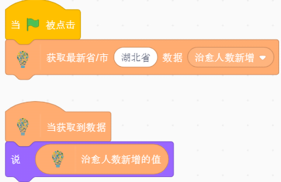
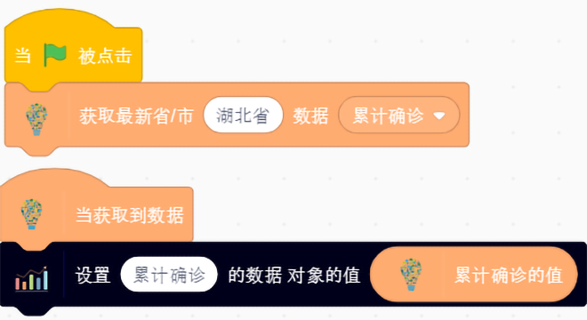

		
---  
# 疫情大数据
  
## 疫情大数据介绍
    通过拖动积木块，获取不同省/市，不同时间点的疫情大数据，包括累计确诊、累计确诊新增、治愈人数、治愈人数新增、现有确诊、现有确诊新增、全国各省累计确诊、全国各省累计治愈的结果

	

## 积木块说明
### 1. 获取最新省/市的数据
获取最新省/市的数据（累计确诊、累计确诊新增、治愈人数、治愈人数新增）。 

  
### 2. 当获取到数据时
当获取到数据时，将会响应。 

   
### 3. 累计确诊
得到累计确诊的值。 

 
### 样例代码  
点击小旗子运行积木块，获取湖北省累计确诊的数据，当拿到数据后，舞台上的小猫将会说获取到的累计确诊的值。  
 

### 4. 累计确诊新增
得到累计确诊新增的值。 

 
### 样例代码  
点击小旗子运行积木块，获取湖北省累计确诊新增的数据，当拿到数据后，舞台上的小猫将会说获取到的累计确诊新增的值。  
  
### 5. 治愈人数
得到治愈人数的值。 

 
### 样例代码  
点击小旗子运行积木块，获取湖北省累计治愈的数据，当拿到数据后，舞台上的小猫将会说获取到的治愈人数的值。  
  
### 6. 治愈人数新增
得到治愈新增人数的值。 

### 样例代码  
点击小旗子运行积木块，获取湖北省累计治愈的数据，当拿到数据后，舞台上的小猫将会说获取到的治愈新增人数的值。  
 

### 7. 获取指定时间省/市的数据
获取指定时间（yyyy/mm/dd）最新省/市的数据（累计确诊、累计确诊新增、现有确诊、现有确诊新增）。 

  
### 8. 现有确诊
得到现有确诊的值。 

  

### 样例代码  
点击小旗子运行积木块，获取2020年2月7日湖北省现有确诊的数据，当拿到数据后，舞台上的小猫将会说获取到的现有确诊的值。  
 
### 9. 现有确诊新增
得到现有确诊新增的值。 

  

### 样例代码  
点击小旗子运行积木块，获取2020年2月7日湖北省现有确诊新增的数据，当拿到数据后，舞台上的小猫将会说获取到的现有确诊新增的值。  

### 10. 获取全国各省/市的数据
获取全国各省/市的数据（累计确诊、治愈人数）。 

  

### 11. 全国各省累计确诊结果
得到全国各省累计确诊结果的值。 

 
### 样例代码  
点击小旗子运行积木块，获取全国各省累计确诊结果的数据，当拿到数据后，舞台上的小猫将会说出全国各省累计确诊结果。  

### 12. 全国各省累计治愈结果
得到全国各省累计治愈结果的值。 

 
### 样例代码  
点击小旗子运行积木块，获取全国各省累计治愈人数的数据，当拿到数据后，舞台上的小猫将会说出全国各省累计治愈结果。  

---
# 数据图表
  
## 数据图表介绍
    通过拖动积木块，设置图标的名称，x轴和y轴的名称，图标的类型，数据的类型以及插入数据的值 

	

## 积木块说明
### 1. 图表名称
设置数据图表名称。 

  
### 样例代码  
点击小旗子运行积木块，设置数据图表的名称为“数据图表”。  
 

### 2. x轴y轴名称
在积木块中输入数据图表x轴和y轴的名称。

  
### 样例代码   
设置数据图表x轴方向和y轴的名称为X,Y，点击小旗子运行积木块。  
  

### 3. 切换图表类型
切换数据图表的类型（柱状图，折线图）。 

  
### 样例代码  
设置数据图表的类型为柱状图，点击小旗子运行积木块。  
   

### 4. 添加数据
在第一个空格内填入数据类型，在第二个空格内X轴名称，在第三个空格内填入Y轴数值 。 

  
### 样例代码  
设置数据类型为出口量，X轴为毛衣，Y轴为188888。表示毛衣的出口量为188888，点击小旗子运行积木块。  
  
### 5. 添加数据对象
在第一个空格内填入数据类型，在第二个空格内填入数据对象。   

  
### 样例代码  
点击小旗子运行积木块，当获取到数据时，设置图表数据类型为“累计确诊”，对象的值为“累计确诊的值”的积木块。   
 

---  
## 地图导航
  
### 地图导航介绍
	用来设置地图风格、定位、公交车路线规划。

### 积木块说明
### 1. 打开路线地图积木块
调起地图窗口，用来显示地图，后续一切操作必须先调起窗口。

### 2. 获取定位积木块
获取现在所在城市或者所在精准街道。

### 3. 设置地图风格积木块
可以设置地图显示风格为马卡龙、涂鸦、幻影黑、草色青。

### 4. 设置地图类型积木块
可以设置地图类型为2D或者3D。

### 5. 切换城市地图积木块
可切换地图到国内省/市所在地。

### 6. 规划路线起点积木块
可用来设置公交路线的起点。

### 7. 规划终点积木块
可用来设置公交路线的终点。

### 8. 规划路线积木块
根据规划起点和规划终点来规划公交路线。

### 9. 设置公交车路径积木块
将公交车放置在指定公交路径的起点。

### 10. 公交车操作积木块
可用来执行公交车发车、公交车暂停、公交车继续行驶、公交车停止行驶。

### 11. 当到达公交站点积木块
当公交车沿着公交规划行驶过程中途径公交站点时，触发。

### 12. 当路线规划完成积木块
当规划路线积木块异步返回时，触发。

### 13. 转乘站点积木块
当规划路线积木块异步返回时会将路线中的转乘站点提取出来。

### 14. 到达的站点积木块
实时返回公交行驶过程中途径的站点。

### 15. 根据转乘站点获取转乘信息积木块
根据转乘站点获取转乘信息，比如获取到的为"换乘92路途径4站到达天安门东"。

### 16. 定位点积木块
返回定位积木块定位到的信息。

### 17. 转乘站点积木块
返回路径规划后的转乘站点信息。

### 18. 路线规划路径积木块
当规划路线完成时，返回公交车行驶的路径信息，比如："东华门--北京妇科医院--沙滩路口北--亮果厂--东皇城根北门--地安门外"。

### 19. 终点站信息积木块
返回公交路径的终点站信息。

### 样例代码  
执行代码，将定位所在地点，并规划出天安门到北京水立方的公交路线，当规划完成时，将公交车发车，行驶过程中会判断经过的站点是否为转乘站点，如果是转乘站点，会获取到达转乘站点后的转乘信息并显示。

		
---  
## 地图展示
  
### 地图展示介绍
	用来在中国地图上展示中国各省的疫情、天气等信息。	

### 积木块说明
### 1. 打开地图积木块
调起中国地图窗口。

### 2. 展示中国各省疫情积木块
用来在地图上展示中国各省或单个省份的确诊分布图或治愈分布图。  

### 样例代码  
打开地图并获取各省市的疫情确诊和治愈信息，当获取到信息时，在地图上展示疫情分布图。

---
 

## 和风天气

### 和风天气介绍
	获取你关心的城市的天气数据:   
	- 温度
	- 湿度
	- 天气状况
	- 降水量	
 

### 1. 读取今天天气
异步获取今天,明天，后天，大后天天气，可以在选框内，填入相应的地址。	

 

### 2. 当天气预报返回

当获得今天天气结果返回，触发。	

 

### 3. 温度

获取返回数据中温度的值。	

 

### 4. 天气状况
获取返回数据中天气状况的值。

 

### 5. 湿度
获取返回数据中湿度的值。		

 

### 6. 降水量
获取返回数据中降水量的值。		

 

#### 示例		
点击小旗子，获取杭州后天天气，然后说出温度，天气状况，湿度，温度的值。

