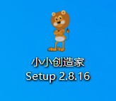
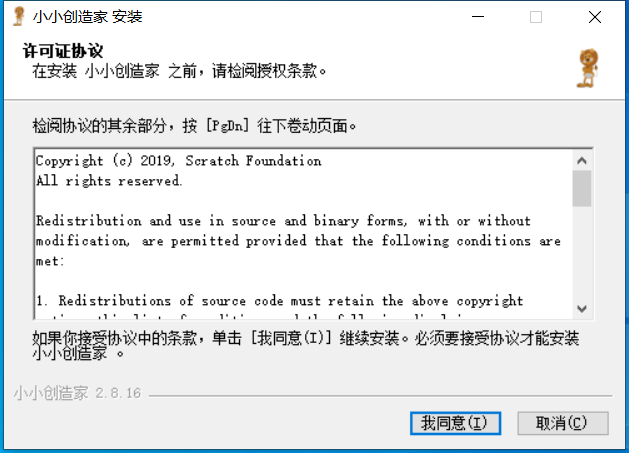
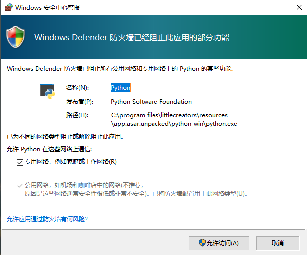
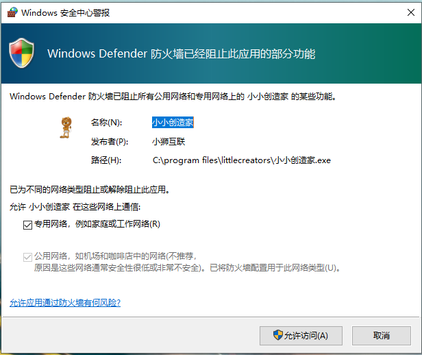
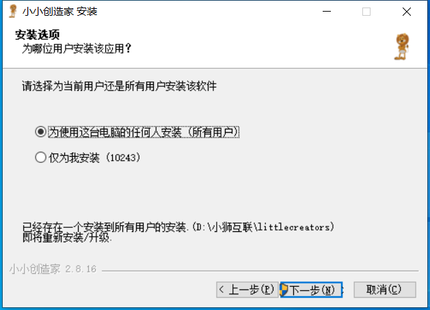
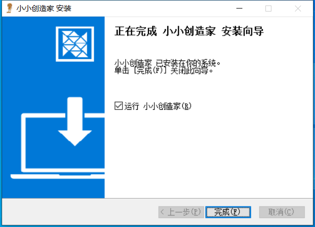

# 客户端安装
    客户端需要在Win7 64位或者win10 64位电脑操作系统上安装。
    在安装客户端的过程中，如果出现询问是否允许访问的窗口，一律点击是，否则会影响使用。
 

1.点击小小创造家客户端安装包进行安装

 

2.点击开始安装客户端

 

 

3.在安装过程中如果出现询问是否允许的窗口，一律点击允许。

 

4.根据提示一步步的安装。

 

5.点击完成安装。

