## 字符串处理

### 字符串处理介绍
	对列表，对象，JSON数组进行处理。	
 

### 1. 将大写数字转成阿拉伯数字
将大写的数字转成阿拉伯数字，并返回。	

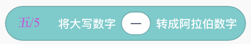

 

### 2. 将语句中的时间提取出来

将语句中的时间提取出来，并返回。例如，”三分钟后“，就是在当前时间基础上加上3分钟	

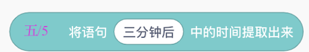

 

### 3. 列表的第1项

获取输入列表的第一项数据。	

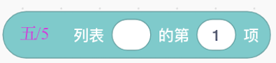
 

### 4. 通过key获取对象
通过输入键值(key)来获取对象。

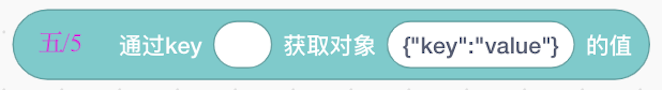
 

### 5. 获取JSON数组
通过输入JSON数组和想要获得第几项，来获取具体的值。		

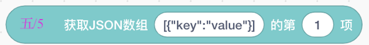
 

### 6. 当时间到达
当时间到达输入的值以后，则触发。		

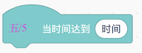
 
---  

## 物联网通信
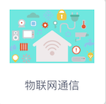

### 物联网通信介绍
	实时通信协议是物联网技术中的一项根本性技术,在数据的有效传输、及时通信方面不可或缺,在物联网领域发挥着至关重要的作用,因此物联网通信协议的制定至关重要。	
 

### 1. MQTT连接服务器
通过输入服务器，用户名，密码，连接服务器。	

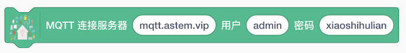

 

### 2. MQTT订阅话题

输入话题名，进行订阅。  	

 

### 3.MQTT广播话题和消息

输入已经订阅过的话题名进行广播，并输入要广播的消息。	

 

### 4. MQTT收到广播
当收到话题名相同的广播则触发，触发。

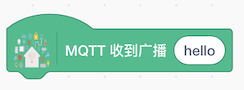
 

### 5. 话题内容
为收到广播的话题内容。		

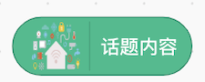
 

#### 示例		
连接服务器.点击小旗子，订阅话题hello，然后广播话题hello消息hello，MQTT收到广播消息触发，舞台上的角色说”hello“。

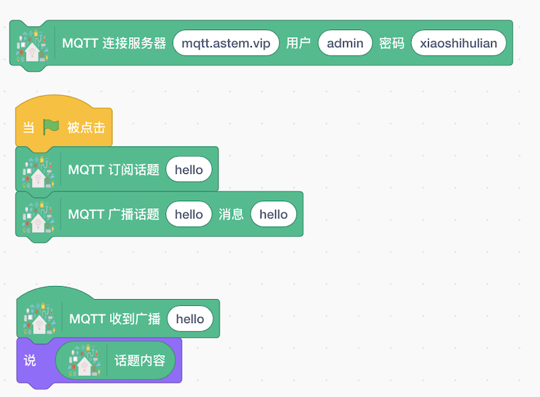

## 局域网通信
 

### 局域网通信介绍
	实时通信协议是物联网技术中的一项根本性技术,在数据的有效传输、及时通信方面不可或缺,在物联网领域发挥着至关重要的作用,因此物联网通信协议的制定至关重要，此功能需要连接小狮盒子，在局域网内进行通信。

###  MQTT连接服务
 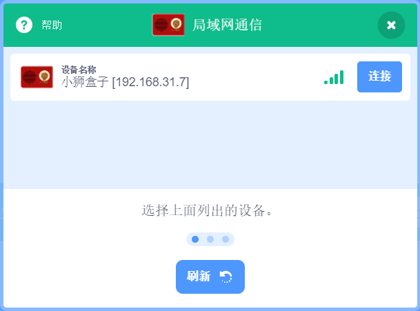

打开小小创造家客户端，添加局域网通信模块，连接小狮盒子。

 

选择IP，连接MQTT服务。	

 

需要接收某个消息时，要先输入话题名，进行订阅。  

 

广播消息给订阅此消息的设备，注意订阅的消息名称和广播的话题名称需要一致	

 

当收到与话题名相同的广播则触发对应事件

 

点击显示收到的话题内容，即发出广播时的消息内容

 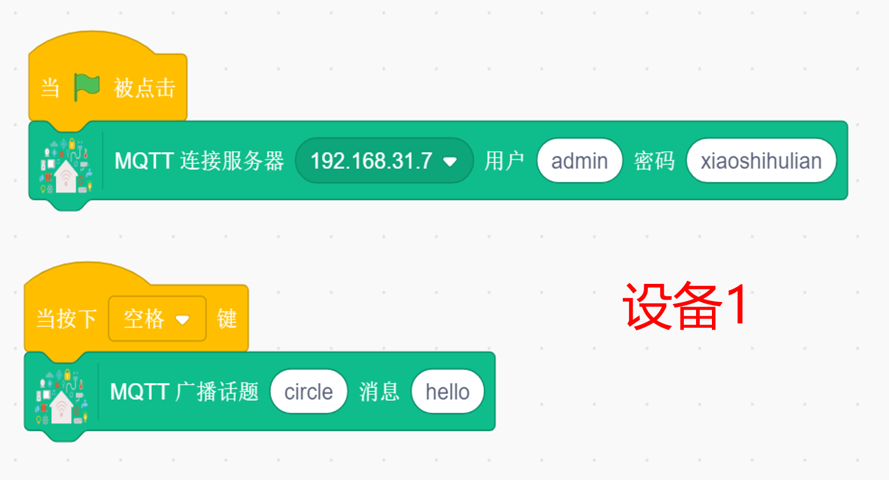

 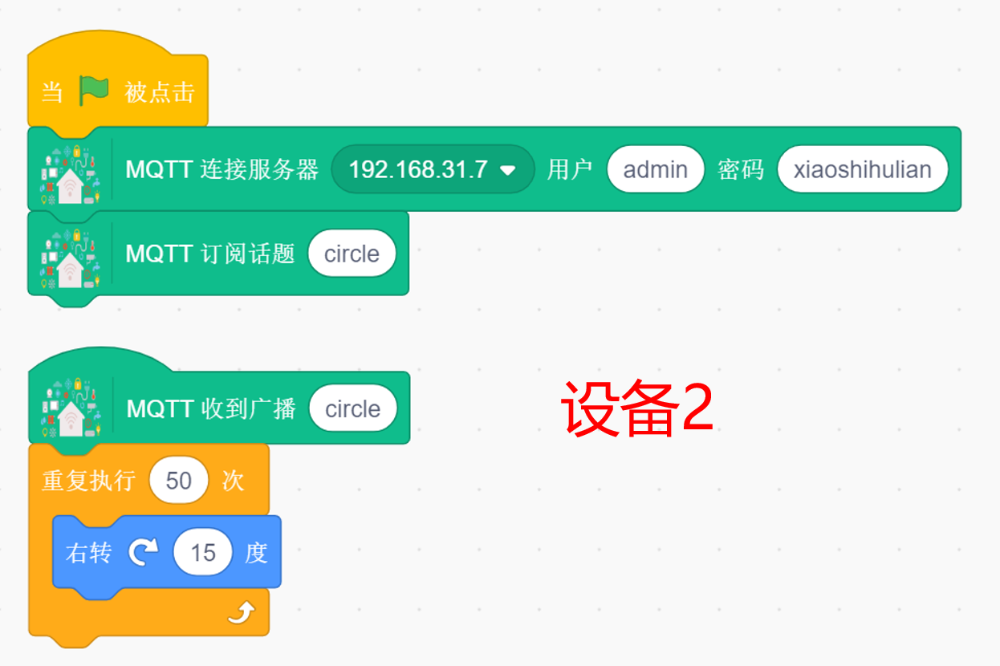

案例说明：当设备1发出话题“circle”时，设备2订阅并收到话题circle，角色转圈。

