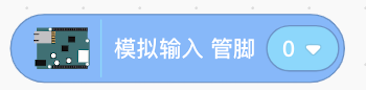

# gpioArduino
  
## gpioArduino介绍
    通过连接Arduino，Arduino板卡能够读取传感器的模拟或数字输入信号，并将其转换为输出，例如激活电机，打开/关闭LED多种操作。
## Arduino通信固件烧入
    小小创造家客户端与Arduino通信需要用到FirmataExpress库。
1.下载安装Arduino IDE工具，下载地址：https://www.arduino.cc/en/software

   

2.打开Arduino，选择工具-管理库安装FirmataExpress库、Ultrasonic库

 
 

3.将Arduino连接电脑，在任务管理器中确认串行口，若连接电脑后，没有端口显示，需要在电脑中下载CH340驱动，在百度网盘中下载：链接：https://pan.baidu.com/s/1NJhjjrZyIC74yKcVEJrpcw 提取码：yqcd 复制这段内容后打开百度网盘手机App，操作更方便哦

端口显示正常后，在Arduino-工具-端口中，勾选上对应的端口。

 

4.给Arduino硬件板子下载固件

 
 

## 连接arduino

	
	通过数据线与Arduino相连，点击gpioArduino插件。	

## 积木块说明
### 1. 数字输出
数字信号输出。 

  
### 2. 模拟输出
模拟信号输出。 

 

### 3. 播放音调
设置频率和时间来播放音调。 

 

### 4. 舵机
设置舵机的角度。 

 

### 5. 模拟输入
模拟信号输入。 

 

### 6. 数字输入
数字信号输入。 

 

### 7. 超声波感测器
通过超声波来测试距离。 

   

# micro:bit
## micro:bit介绍
 

micro:bit 是一款由英国广播电视公司（BBC）推出的专为青少年编程教育设计的微型电脑开发板，2016年3月6月，micro:bit 在英国全线铺开，BBC在线上线下配套了大量的项目教程资源和活动。BBC希望通过 micro:bit 驱动青少年参与到创造性的硬件制作和软件编程中去，而不是每天沉浸在各式的娱乐和消费中。
micro:bit 的正面设计有两个按钮，5×5 LED点阵，反面设计有蓝牙天线，运动传感器，重置按键等。
## 连接 micro:bit
### 安装scratch link
下载地址：https://downloads.scratch.mit.edu/link/windows.zip
### 解决Scratch link无法连接问题：域名被污染
需要修改本机 hosts 文件，host文件路径：
Windows: C:\Windows\System32\drivers\etc\hosts
Mac/Linux: /etc/hosts

添加如下规则:127.0.0.1 device-manager.scratch.mit.edu

  

    注意：若无法修改host文件，可以先将host文件剪切到桌面上修改，修改完成后，再粘贴到etc目录下

### 打开电脑蓝牙
 

### 打开小小创造家客户端连接
 

找到ScratchLink应用，双击运行

 

添加microbit模块，并连接

## 积木指令说明
 

当按下micro:bit面板上的A、B或任意键时，触发对应的事件。

 

判断是否按下A、B或任意键

 

当micro:bit面板移动、晃动、抛起时，触发对应的事件

 

设置micro:bit面板上的点阵图案

 

设置micro:bit面板上的文字显示

 

清空micro:bit面板上显示的文字和图案

 

当micro:bit面板向前、后、左、右或任意的方向倾斜时，触发对应的事件

 

判断当前micro:bit面板是否向前、后、左、右或任意的方向倾斜

 

当前micro:bit面板的各个方向的倾斜角

 

当连接micro:bit面板上的对应引脚时，触发对应事件

 

案例说明：当按下micro:bit面板上的A键时，点阵屏显示A，当按下micro:bit面板上的B键时，点阵屏显示B，

 

案例说明：当按下micro:bit面板向前倾时，点阵屏上显示forward，当按下micro:bit面板向后倾时，点阵屏上显示backwards

