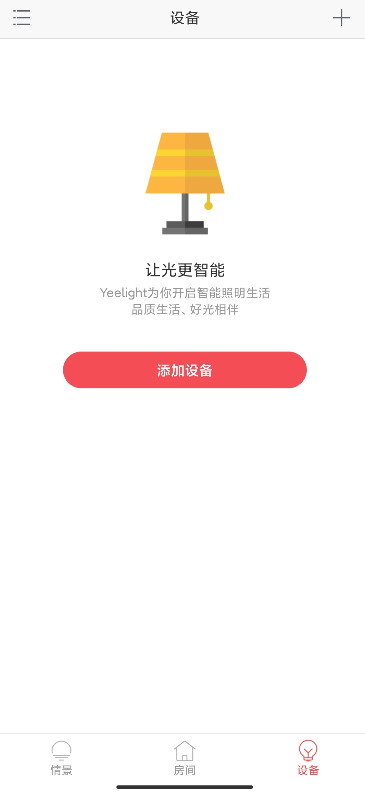
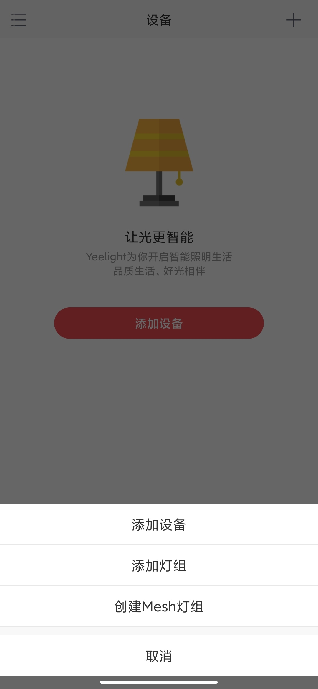
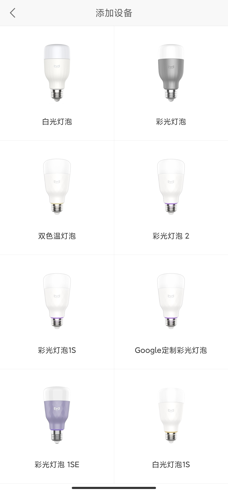
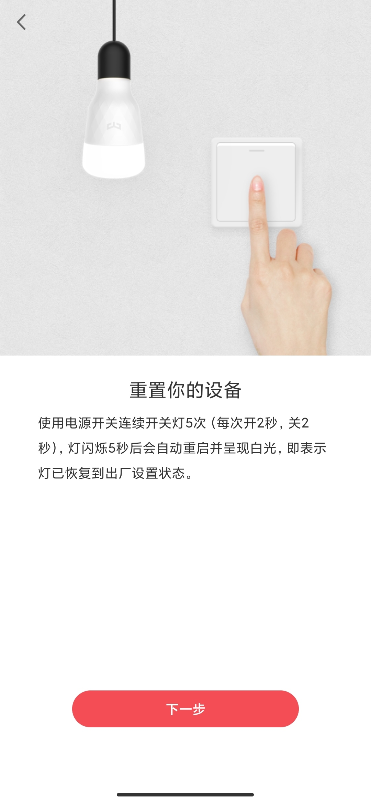
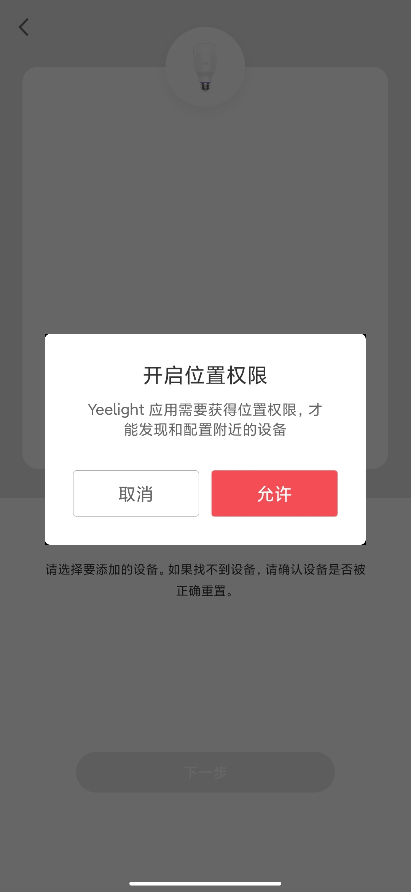
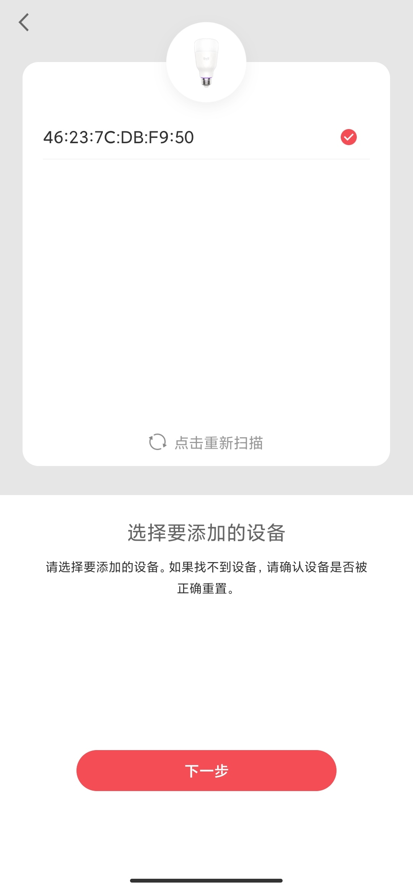
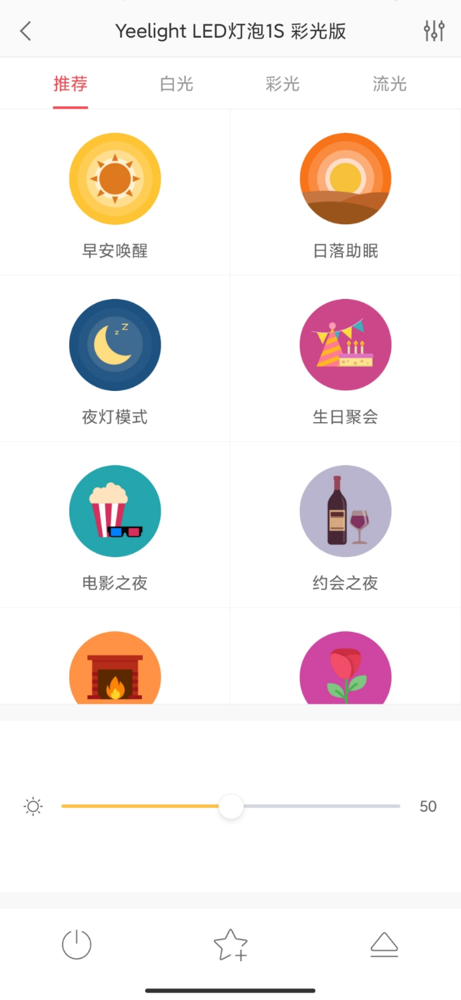
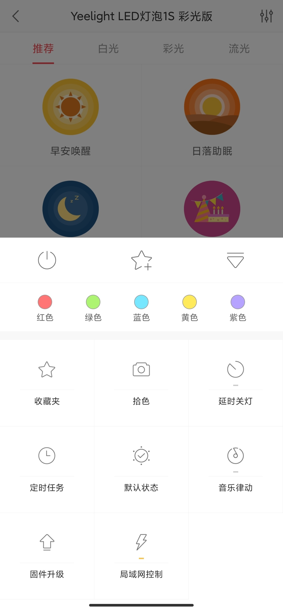
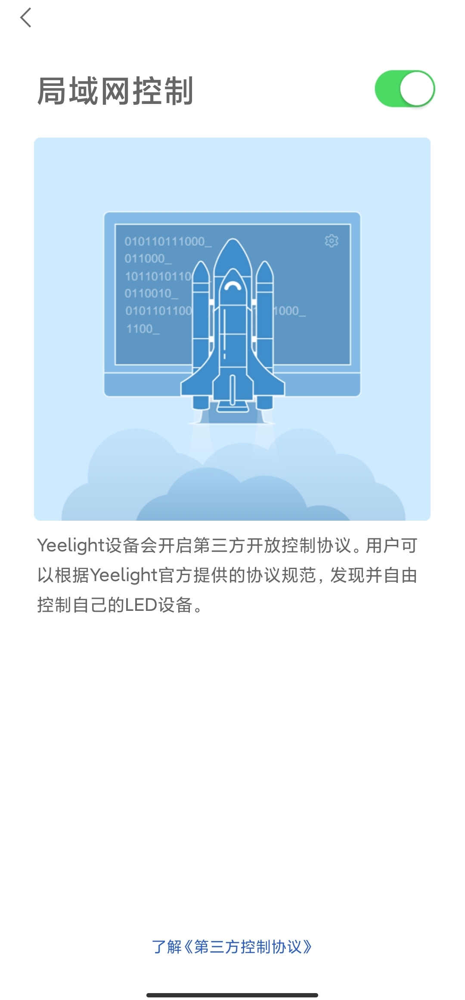

# 智能LED彩光灯配置步骤

# 准备工作
1.准备Yeelight智能灯1S。
2.下载Yeelight APP，可以在各手机应用市场下载。

# 配置步骤
1.将Yeelight灯插在插座上。
2.打开Yeelight APP，点击设备页中的添加设备按钮。
  

3.在弹出的信息中，选择添加设备。
  

4.选择彩光灯泡1S。
  

5.根据页面提示重置yeelight灯。
  

6.yeelight灯重置完成后，根据提示开启位置权限。
  

7.点击扫描设备，并添加扫描到的设备。
 

8.设备连接中。
  

9.设备添加成功后，在Yeelight APP首页点击yeelight灯，进入以下页面,点击右下角向上的箭头。
  

10.选择局域网控制按钮。
  

11.确保局域网控制按钮处于打开的状态。
 

12.这样就可以通过手机控制智能LED彩光灯了。
 