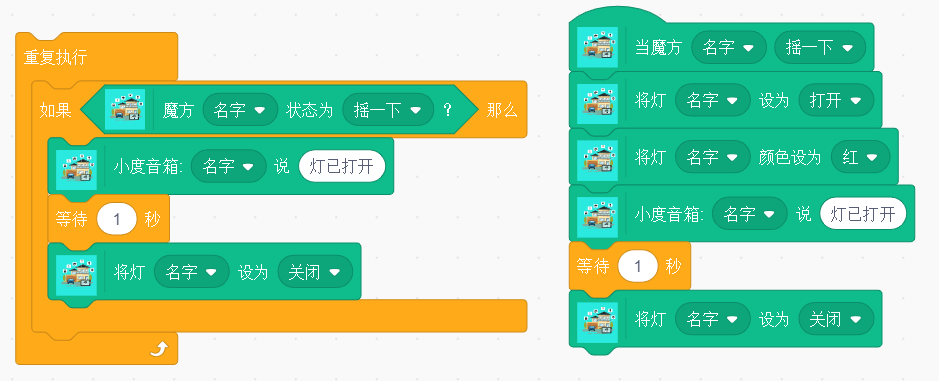
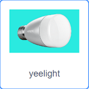
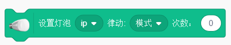
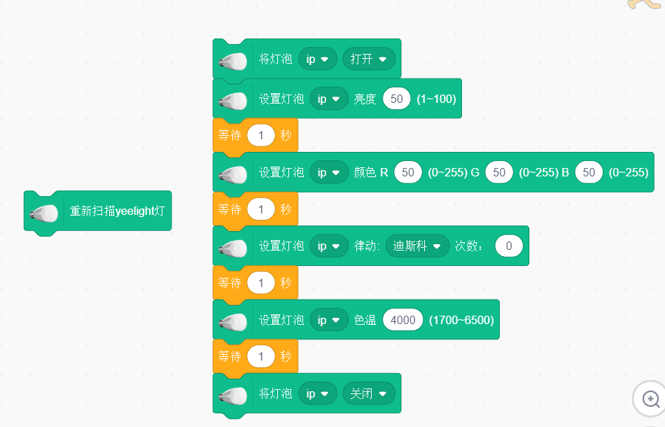

# 小小创造家插件介绍

> 
# 智能家居

	包含米家智能家居、泥巴机器人、机器学习等10余种人工智能软、硬件积木插件。	
	基于米家智能家居套件，让儿童充分体验空间编程。该插件基于dlna设备发现功能去获取自配置的小狮网关IP。

---
## 米家智能家居套装  
	
	包括米家智能网关、无线开关、人体红外、门窗传感器、智能插座几种智能家居常用的智能硬件设备。 
	 

米家智能网关

	
	网关作用，用来自动检测网关下的所有设备并通信。

无线开关

	
	开关作用，按下即动作，松开释放。在教学场景中可以用来作为开关按键控制。

人体红外

	人体红外作用，用来探测是否有人经过。频率为一分钟探测一次。

门窗传感器

	门窗传感器作用，用来感应门窗的打开和闭合。

智能插座

	智能插座作用，用来将插入的识别智能化。

## 魔方控制器

	魔方控制器是一款基于动作感应的智能无线控制器，识别6种控制动作。分别是：
	- 摇一摇
	- 敲两下
	- 翻转90°
	- 翻转180°
	- 平面旋转
	- 推一推
	这些动作单个使用或者组合起来使用，在教学场景中可以用来作为密码锁，或者开关使用。  

 

## dlna设备发现说明  
	
	dlna可自动发现局域网内的小狮网关信息,加载智能家居插件时，在弹框中显示所有扫描到的小狮网关信息。用户点击自己的小狮网关对应的IP即可与小狮网关建立连接。进行相应的智能硬件操作。

### dlna扫描发现

##积木块操作
	
### 1. 操作灯积木	

将通过局域网接入的智能灯打开或者关闭。

 

### 2. 设置灯颜色积木

将通过局域网接入的智能灯颜色设成指定的七种颜色。

 

### 3. 设置灯颜色积木（rgb）

设置智能灯的闪烁跳动模式。		

 

### 4. 无线开关积木

当指定的无线开关进行单击，双击等操作时，触发。

 

### 5. 人体红外探测积木

当指定的红外探测器探测到人体通过时触发。
> _注意：该模块受米家智能硬件条件限制，1分钟内只能触发一次。_		

 

### 6. 门窗传感器积木

当指定的门窗传感器打开或者闭合时，触发。
	

 

### 7. 魔方控制器积木

当指定的魔方进行翻转等相应操作时，触发。	

 

### 8. 百度音箱

使用百度音箱进行文字tts文字播报。

 

### 9. 判断魔方状态积木块

判断指定魔方最新状态和所选状态是否一致。

 

### 10. 判断开关状态积木块

判断指定开关最新状态和所选状态是否一致。

 

### 11. 判断门窗状态积木块

判断指定门窗最新状态和所选状态是否一致。
	

 

### 12. 判断人体传感器状态积木块

判断指定人体传感器最新状态和所选状态是否一致。	

 

### 示例	
当魔方进行摇一下操作时，会触发执行将灯打开，将灯的颜色设成红色，小度音箱播报，灯已打开，一秒之后，将灯关闭，左边积木块会检测魔方的状态，当魔方摇动时，小度音箱会说灯已打开，并将灯关闭。	

 

---  
##  彩光LED灯泡

### 彩光LED灯泡介绍
	彩光LED灯泡可以设计成各种模式和颜色。丰富家庭氛围。

 

### 1.扫描彩光LED灯泡积木块
扫描客户端所在局域网下的所有彩光LED灯泡。

 

### 2.设置彩光LED灯泡颜色积木块
将彩光LED灯泡设置成不同的rgb颜色值。
	

 

### 3.设置彩光LED灯泡亮度积木块
将彩光LED灯泡设置成相应的亮度，取值为0~100。

 

### 4.设置彩光LED灯泡色温积木块
将彩光LED灯泡设置成相应的色温，取值为1700~4500。

 

### 5.设置彩光LED灯泡律动模式积木块
将彩光LED灯泡设置成相应的亮度，取值为0~100。

 

### 6.控制彩光LED灯泡开关积木块
将彩光LED灯泡打开或者关闭。

 

### 示例		
	
首先扫描所有的彩光LED灯泡，选择其中的某个灯进行相应的打开，改变亮度，改变颜色，改变色温，关闭。

 

---
 