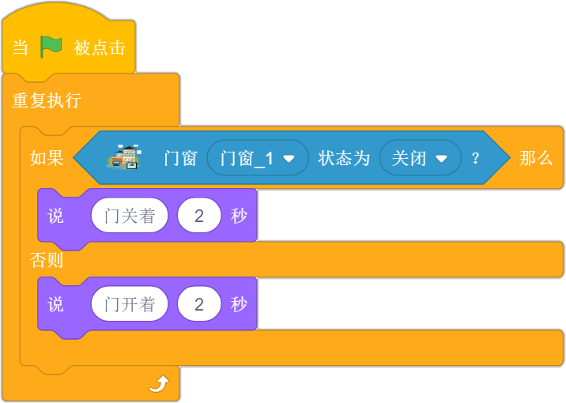
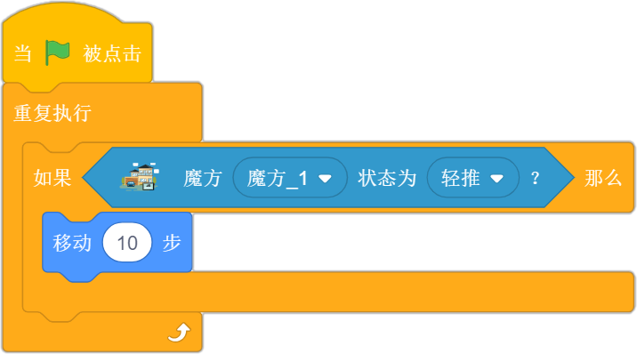
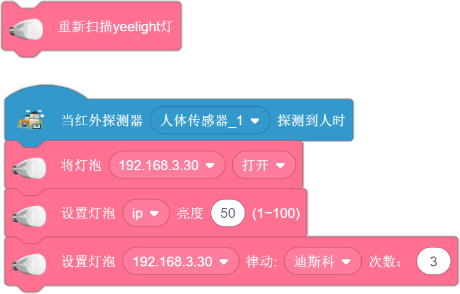

# 小小创造家插件介绍

> 
# 智能家居模块
## 小米网关灯

| 指令                                   | 功能                              | 案例                                                     | 参考程序                                    |
| -------------------------------------- | --------------------------------- | -------------------------------------------------------- | ------------------------------------------- |
|  | 将网关灯打开或关闭 。             | 当响度大于30时，网关灯打开，过一会熄灭。                 |   |
|  | 改变网关灯亮度。                  | 按下左移键，网关灯亮度较暗；按下右移键，网关灯亮度较亮。 |   |
|  | 将网关灯的颜色改为指定颜色。      | 网关灯的颜色每一秒变化一次。                             |   |
|   | 通过修改RGB的值改变网关灯的颜色。 | 将网关灯的颜色调整为最绿色。                             |  |
## 小度音箱

| 指令                                     | 功能                             | 案例                                     | 参考程序                                       |
| ---------------------------------------- | -------------------------------- | ---------------------------------------- | ---------------------------------------------- |
|  | 可以规定小度音箱语音播报的内容。 | 当网关灯亮起时，小度音箱播报“欢迎光临”。 |  |

## 小米开关
| 指令                                     | 功能                                     | 案例                                                         | 参考程序                                                 |
| ---------------------------------------- | ---------------------------------------- | ------------------------------------------------------------ | -------------------------------------------------------- |
|  | 当触发开关对应的动作时，执行对应事件。   | 当开关长按时，角色右转一段时间                               |  |
|  | 当开关的状态满足条件时，执行对应的动作。 | 当开关的状态为单击时，角色一直说：“你好”，直到开关的状态被改变,条件不满足。 |      |

## 人体红外传感器
| 指令                                           | 功能                                     | 案例                                                         | 参考程序                                       |
| ---------------------------------------------- | ---------------------------------------- | ------------------------------------------------------------ | ---------------------------------------------- |
|      | 当有人体的存在或移动时，执行对应事件。   | 当有人体的存在或移动时，小度音箱说：“你好呀！”               |    |
|  | 当检测到有人体的存在或移动时，条件成立。 | 当有人体的存在或移动时，小度音箱说：“你好呀！”，当人离开时，有人的状态会保持一分钟。 |  |

## 小米门窗传感器
| 指令                                           | 功能                                       | 案例                                                         | 参考程序                                     |
| ---------------------------------------------- | ------------------------------------------ | ------------------------------------------------------------ | -------------------------------------------- |
|      | 当门窗传感器打开或关闭时，执行对应的事件。 | 将门窗传感器贴在门上后，每当门打开时，小度音箱会说“欢迎光临”。 |      |
|  | 判断门窗传感器状态是否满足对应条件。       | 当门窗传感器的状态为关闭时，角色提示“门关着”，否则提示“门开着”。 |  |

## 小米魔方
| 指令                                     | 功能                                 | 案例                                                         | 参考程序                                     |
| ---------------------------------------- | ------------------------------------ | ------------------------------------------------------------ | -------------------------------------------- |
|  | 判断魔方当前的动作状态是否满足条件。 | 当满足魔方的动作状态为轻推时，魔方会向前移动10步，直到状态被改变，条件不满足时，停止运动。 |  |

## 彩光灯LED灯泡

| 指令                                                         | 功能                                         |
| ------------------------------------------------------------ | -------------------------------------------- |
|  | 扫描客户端所在局域网下的所有彩光LED灯泡。    |
|  | 将彩光灯打开或关闭。                         |
|  | 设置彩光的亮度 。                            |
|  | 通过调节彩光灯的RGB数值 ，改变彩光灯的颜色。 |
|  | 通过改变数值调节彩光灯的色温 。              |
|  | 设置彩光灯的律动效果，并选择对应的律动次数。 |

| 案例                                                         | 参考程序                                           |
| ------------------------------------------------------------ | -------------------------------------------------- |
| 
当人体红外传感器检测到有人出现或移动时，LED彩光灯亮起，营造迪斯科氛围。需要注意，使用彩光灯时，需要先进行扫描。 
 |  |