# 小小创造家插件介绍

> 
# 智能家居模块
	包含米家智能家居、泥巴机器人、机器学习等10余种人工智能软、硬件积木插件。	
	基于米家智能家居套件，让儿童充分体验空间编程。该插件基于dlna设备发现功能去获取自配置的小狮网关IP。

---
## 米家智能家居套装  
	
	包括米家智能网关、无线开关、人体红外、门窗传感器、智能插座几种智能家居常用的智能硬件设备。 
	 
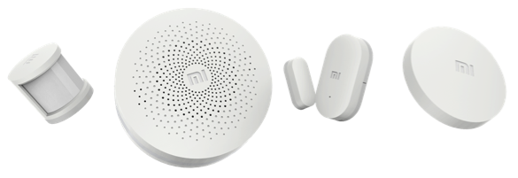

米家智能网关

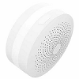
	
	网关作用，用来自动检测网关下的所有设备并通信。

无线开关

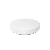
	
	开关作用，按下即动作，松开释放。在教学场景中可以用来作为开关按键控制。

人体红外

	人体红外作用，用来探测是否有人经过。频率为一分钟探测一次。

门窗传感器

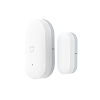

	门窗传感器作用，用来感应门窗的打开和闭合。

智能插座

	智能插座作用，用来将插入的识别智能化。

## 魔方控制器

	魔方控制器是一款基于动作感应的智能无线控制器，识别6种控制动作。分别是：
	- 摇一摇
	- 敲两下
	- 翻转90°
	- 翻转180°
	- 平面旋转
	- 推一推
	这些动作单个使用或者组合起来使用，在教学场景中可以用来作为密码锁，或者开关使用。  

 

## dlna设备发现说明  
	
	dlna可自动发现局域网内的小狮网关信息,加载智能家居插件时，在弹框中显示所有扫描到的小狮网关信息。用户点击自己的小狮网关对应的IP即可与小狮网关建立连接。进行相应的智能硬件操作。

### dlna扫描发现

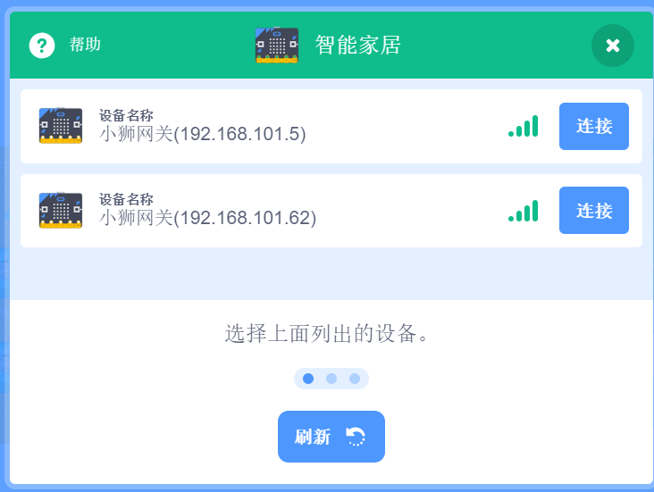

## 小米网关灯

|   指令  |  功能   |  案例   |  参考程序   |
| --- | --- | --- | --- |
||  将网关灯打开或关闭 。  | 当响度大于30时，网关灯打开，过一会熄灭。    | 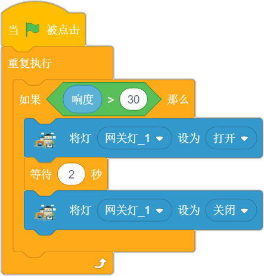   |
|  | 改变网关灯亮度。    | 按下左移键，网关灯亮度较暗；按下右移键，网关灯亮度较亮。    |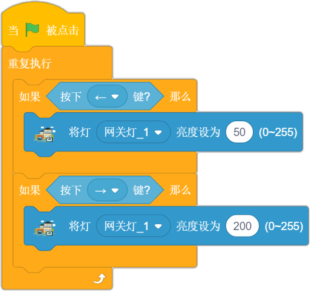 |
| |  将网关灯的颜色改为指定颜色。   |   网关灯的颜色每一秒变化一次。  |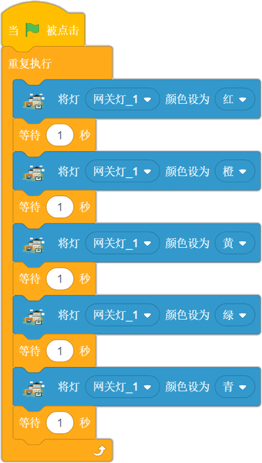  |
||  通过修改RGB的值改变网关灯的颜色。 |将网关灯的颜色调整为最绿色。| |
## 小度音箱

|    指令 | 功能    |  案例   |参考程序     |
| --- | --- | --- | --- |
|   |    可以规定小度音箱语音播报的内容。 |  当网关灯亮起时，小度音箱播报“欢迎光临”。|  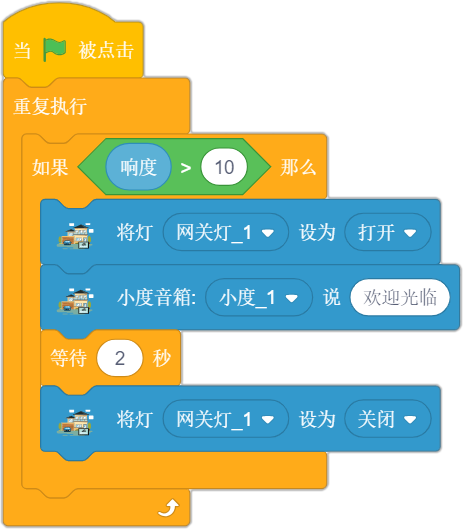 |

## 小米开关
|    指令 | 功能    |  案例   |参考程序     |
| --- | --- | --- | --- |
||    当触发开关对应的动作时，执行对应事件。 | 当开关长按时，角色右转一段时间|   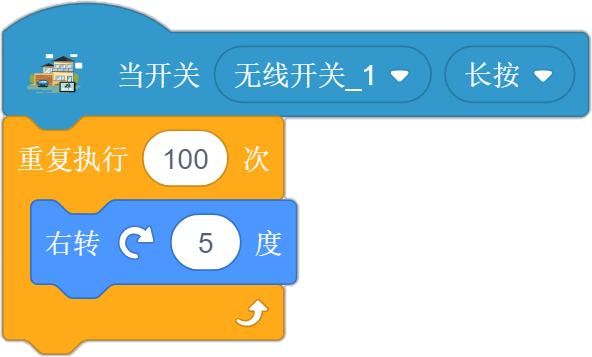|
|| 当开关的状态满足条件时，执行对应的动作。| 当开关的状态为单击时，角色一直说：“你好”，直到开关的状态被改变,条件不满足。|  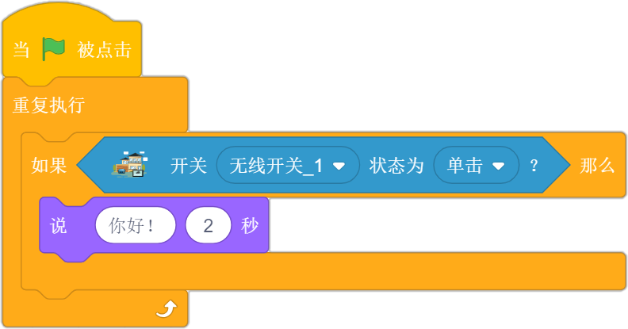|

## 人体红外传感器
|    指令 | 功能    |  案例   |参考程序     |
| --- | --- | --- | --- |
||    当有人体的存在或移动时，执行对应事件。 | 当有人体的存在或移动时，小度音箱说：“你好呀！”||
||    当检测到有人体的存在或移动时，条件成立。 | 当有人体的存在或移动时，小度音箱说：“你好呀！”，当人离开时，有人的状态会保持一分钟。|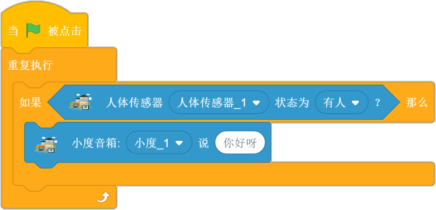|