## 泥巴机器人

 

## 常见问题说明
### Windows环境USB摄像头与本地电脑摄像头冲突，无法找到
如下图所示，为教学使用USB摄像头，具体型号以实际使用为准。	

				
 
1.打开设备管理器 		

 

2.找到照相机	

				
	
3.鼠标右键点击设备名称，然后选择“禁用设备”，然后关闭设备管理器。  

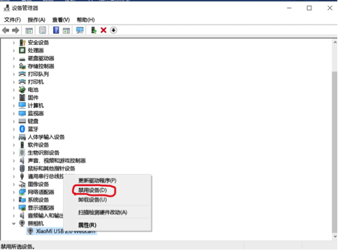	
	
4.将外界摄像头通过USB连接电脑，再使用摄像头的时候就可以愉快地使用USB摄像头了。

 

### 泥巴机器人主机更新固件

在百度网盘中下载更新固件安装包：链接https://pan.baidu.com/s/1bDCJ2ZaBDk4Dfq2xbzJmSQ提取码：vk9s 复制这段内容后打开百度网盘手机App，操作更方便哦
更新方法：
1.将泥巴机器人通过USB与电脑连接。
2.打开新固件文件夹，找到flash文件，鼠标右击falsh文件，选择编辑。
3.修改COM端口号，与设备管理器中的端口号保持一致。
 
 

### 泥巴机器人无法通过USB连接计算机

1.需要在电脑中安装驱动，在百度网盘中下载：链接：https://pan.baidu.com/s/1NJhjjrZyIC74yKcVEJrpcw 提取码：yqcd 复制这段内容后打开百度网盘手机App，操作更方便哦
2.下载完毕后双击打开文件夹中的setup文件，点击安装即可，若提示安装失败，点击卸载，重新安装。
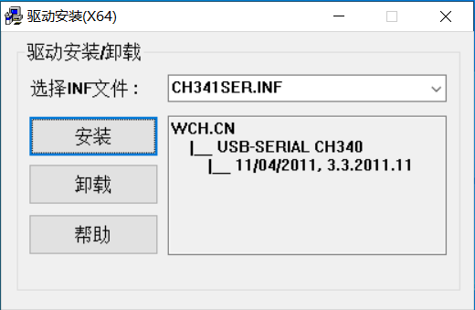 

### 积木块说明
### 1. 当前连接状态
点击积木块，得到当前连接状态。

### 2. USB配网SSID
点击积木块，进行配网。

### 3. 电池电量
点击积木块，获取电池电量的值。

### 4. 控制端口马达运行功率
点击积木块，设置指定端口马达运行功率，默认为100。

### 5. 控制端口马达运行角度功率
点击积木块，控制马达方向和功率。

### 6. A马达实时转速
点击积木块，获得A马达实时转速。

### 7. B马达实时转速
点击积木块，获得B马达实时转速。

### 8. C马达实时转速
点击积木块，获得C马达实时转速。

### 9. D马达实时转速
点击积木块，获得D马达实时转速。

### 11. 小车设置马达
点击积木块，设置小车左右两个马达。

### 12. 小车预设速度
点击积木块，设置小车预设的速度。

### 13. 小车（前进，后退，刹车）
点击积木块，设置小车是前进，后退还是刹车.

### 14. 小车转向差速
点击积木块，设置小车转向差速。

### 15. 设置在屏幕中显示内容
点击积木块，设置在屏幕传感器。

### 16. 设置LED颜色
点击积木块，设置LED的颜色。

### 17. 超声波距离
点击积木块，获得超声波距离.

### 18. 灰度传感器照明
点击积木块，设置灰度传感器照明颜色.

### 19. 端口灰度
点击积木块，获得灰度的值.  

### 20. 黑白阈值
点击积木块，设置黑白阈值，默认值为500.

### 21. 判断端口是否为黑
点击积木块，判断是否为黑色.

### 22. 判断端口是否为白
点击积木块，判断是否为白色.  

### 23. 判断颜色是否为[颜色]
点击积木块，通过灰度传感器照明判断是否为选择的颜色.   

### 24. 设置端口为[输入，输出]
点击积木块，设置端口为输入或者输出.   

### 25. 判断端口为输入电平
点击积木块，判断端口是否为输入电平，若是，返回true. 

### 26. ADC
点击积木块，设获得ADC数据.

### 27. 判断触碰开关
点击积木块，若按下传感器开关，返回1，没有按下开关，返回0.  

### 28. 响度
点击积木块，获得声音响度的值.

### 29. 温度
点击积木块，通过传感器，获得温度的值.

### 30. 湿度
点击积木块，通过传感器，获得湿度的值.  

### 31. 压强
点击积木块，通过传感器，获得压强的值.

### 32. 海拔
点击积木块，通过传感器，获得海拔的值.

### 33. 设置蜂鸣响度
点击积木块，设置蜂鸣器响度.  

### 34. 停止蜂鸣
点击积木块，停止蜂鸣.

---  

## 大疆无人机（单机版）

### 大疆无人机（单机版）介绍
	单机版模块通过连接大疆无人机自带wifi接入大疆无人机，对大疆无人机作起飞，降落，移动，翻转等一系列操作。

### 硬件说明

大疆无人机   

	
	1.单击tello右侧按钮进行开机和关机
	2.开机状态下长按按钮五秒以上进行无人机重置

### dlna设备发现说明  

	连接大疆WiFi，dlna可自动发现大疆无人机，点击建立与无人机的连接。
#### dlna扫描发现

### 积木块说明
### 1. 准备积木块
点击积木块，使无人机处于准备起飞状态。

### 2. 起飞积木块
点击积木块，无人机起飞。

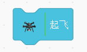
### 3. 降落积木块
点击积木块，无人机降落。

### 4. 向前积木块
点击积木块，积木块向自身正前方行驶。

### 5. 向后积木块
点击积木块，积木块向自身正后方行驶。

### 6. 向上积木块
点击积木块，积木块向自身正上方行驶。

### 7. 向下积木块
点击积木块，积木块向自身正下方行驶。

### 8. 向左积木块
点击积木块，积木块向自身正左方行驶。

### 9. 向右积木块
点击积木块，积木块向自身正右方行驶。

### 10. 顺时针旋转积木块
点击积木块，使无人机按照顺时针旋转指定角度。

### 10. 逆时针旋转积木块
点击积木块，使无人机按照逆时针旋转指定角度。

### 10. 翻转积木块
点击积木块，使无人机在空中按照指定方向翻转。

### 10. wifi积木块
点击积木块，连接wifi（wifi名字和密码不能包含空格和下划线）,使无人机进入ap模式，方便多机版使用。

### 10. 速度积木块
点击积木块，设置无人机的飞行速度。

### 样例代码  
执行代码，无人机将依次起飞，向上，向下，顺时针，设置速度，向左，翻转，降落。  

---

## 大疆无人机（多机版）

### 大疆无人机（多机版）介绍
	多机版可以同时控制同一局域网内的多台tello无人机，可进行编队飞行。

### 硬件说明

大疆无人机   

	
	1.单击tello右侧按钮进行开机和关机
	2.开机状态下长按按钮五秒以上进行无人机重置

### 积木块说明
### 1. 扫描无人机积木块
点击积木块，将所在局域网内的所有无人机对应的IP扫描出来(确保已在单机模式上使用wifi积木块连入局域网)。

### 2. 翻转积木块
点击积木块，设置指定IP对应的无人机向前或向后或向左或向右翻转360度。

### 3. 起飞降落积木块
点击积木块，设置指定IP对应的无人机起飞或降落。

### 4. 无人机行驶操作积木块
点击积木块，设置指定IP对应的无人机向上或向下或向左或向右或向前或向后或顺时针或逆时针行驶指定距离，亦可设置指定速度。

### 样例代码  
先重置无人机，连接无人机自带的wifi，连接后扫描tello无人机,并通过左上角积木块连接到自己的局域网wifi（wifi名字和密码不能包含空格和下划线），之后将客户端网络切成自己的局域网wifi,通过多机版积木块重新扫描tello无人机，之后便可通过语音控制无人机起飞和降落等操作。

---
## 机甲大师
  
### 机甲大师介绍
	用来控制大疆系列robomaster S1和robomaster EP,机甲大师与客户端通过连入同一局域网方式进行通信，在客户端中可通过扫描积木块获取到大疆EP的IP地址，通过多IP可实现多机联动操作。	

### 积木块说明
### 1. 扫描积木块
扫描局域网内的所有robomaster机甲。

### 2. 准备积木块
与指定IP的robomaster机甲进行通信，使robomaster处于接受命令状态。

### 3. 电量积木块
获取指定IP的robomaster机甲的电池电量。

### 4. 运动模式积木块
切换指定IP的robomaster机甲的运动模式如：云台跟随底盘运动等。

### 5. 底盘运动速度积木块
控制指定IP的robomaster机甲以指定速度行驶。

### 6. 底盘旋转速度积木块
控制指定IP的robomaster机甲以指定速度旋转。

### 7. 底盘运动，旋转速度积木块
控制指定IP的robomaster机甲以指定速度行驶并可以旋转自身，可实现转弯效果。

### 8. 底盘运动距离积木块
控制指定IP的robomaster机甲向指定方向移动指定的距离。

### 9. 底盘旋转角度积木块
控制指定IP的robomaster机甲旋转指定角度。

### 10. 刹车积木块
控制指定IP的robomaster机甲停止行驶。

### 11. 云台旋转积木块
控制指定IP的robomaster机甲的云台向指定方向旋转指定角度。

### 12. 云台旋转速度积木块
控制指定IP的robomaster机甲的云台向指定方向以指定速度旋转。

### 13. 发射器发射量积木块
获取指定IP的robomaster机甲的发射器炮弹发射量。

### 14. 发射积木块
控制指定IP的robomaster机甲发射炮弹。

### 15. 设置发射量积木块
设置指定IP的robomaster机甲炮弹每次发射量。

### 16. 机械臂相对移动积木块
控制指定IP的robomaster机甲的机械臂相对移动指定距离。

### 17. 积木块绝对移动积木块
控制指定IP的robomaster机甲的机械臂绝对移动指定距离。

### 18. 机械臂回中积木块
控制指定IP的robomaster机甲的机械臂移动到中心位置。

### 19. 机械臂停止积木块
控制指定IP的robomaster机甲的机械臂停止运动。

### 20. 打开机械爪积木块
控制指定IP的robomaster机甲的机械爪打开。

### 21. 关闭机械爪积木块
控制指定IP的robomaster机甲的机械爪关闭。

### 22. 控制红外积木块
打开/关闭指定IP的robomaster机甲的红外传感器。

### 23. 获取红外距离积木块
获取指定IP的robomaster机甲的红外距离，单位（cm）。

### 24. 控制摄像头积木块
控制指定IP的robomaster机甲的摄像头打开或关闭。

### 25. 摄像头积木块
该积木块与其他插件中的打开xx摄像头一起使用，可获取视频流数据，前提要先使用控制摄像头积木块打开摄像头。

### 26. 设置识别颜色积木块
设置指定IP的robomaster机甲的智能识别中线识别，标签识别识别指定颜色的线，标签。

### 27. 打开/关闭智能推送积木块
控制指定IP的robomaster机甲的智能属性数据推送打开或关闭（人，标签不能同时开启）。

### 28. 获取识别人数积木块
获取指定IP的robomaster机甲智能识别识别到的人数。

### 29. 获取标签信息积木块
获取指定IP的robomaster机甲智能识别识别到的标签个数和坐标信息。

### 30. 获取线信息积木块
获取指定IP的robomaster机甲智能识别识别到的线个数和坐标信息。

### 31. 获取标记坐标积木块
获取指定IP的robomaster机甲智能识别识别到的标签指定轴坐标。

### 32. 设置PID积木块
创建PID实例，设置参数KP KI KD。

### 33. PID结果积木块
拿到视觉坐标与视觉中心点插值的PID结果输出。

### 样例代码  
扫描连接机甲大师，控制机甲大师移动和机械臂移动。

---
## 履带式小车
  
### 履带式小车介绍
	包括小车行驶和小车传感器
- `小车行驶` - 对小车的驾驶速度，驾驶时间以及小车的等进行控制
 	- 基本特征包括：年龄、性别、有无眼镜
-  `小车传感器` - 包括了颜色传感器，角度传感器，速度传感器和环境光传感器
### 硬件说明
sphero rvr 

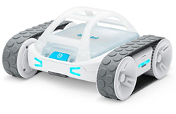

​	

### 积木块说明
### 1. 开始连接小车
填写IP地址连接小车。

### 2. 启动小车
设置小车的启动速度(0-255)以及一开始头朝向的角度(行车方向0-359)。  

### 样例代码  
填写积木块上的IP地址连接小车，设置小车启动速度为25，头朝向角度为0，点击小旗子运行。

### 3. 小车后退
设置小车的速度，角度和运行时长，让小车向后运动。  

### 样例代码  
填写积木块上的IP地址连接小车，设置小车启动速度为25，角度为45，运行时长为3秒，点击小旗子运行。

### 4. 小车前进
设置小车的速度，角度和运行时长，让小车向前运动。  

### 样例代码  
填写积木块上的IP地址连接小车，设置小车启动速度为25，角度为45，运行时长为3秒，点击小旗子运行。

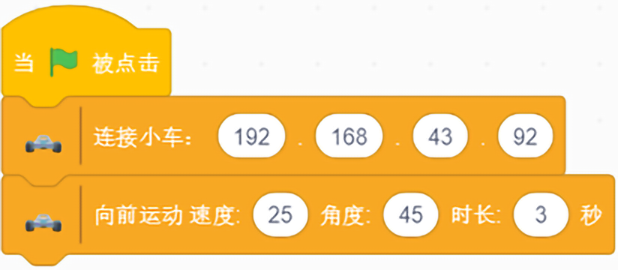
### 5. 小车左转  
设置小车的左转向，填入角度，控制小车向左转的角度。  

### 样例代码    
填写积木块上的IP地址连接小车，设置小车向左转角度为90，点击小旗子运行。  

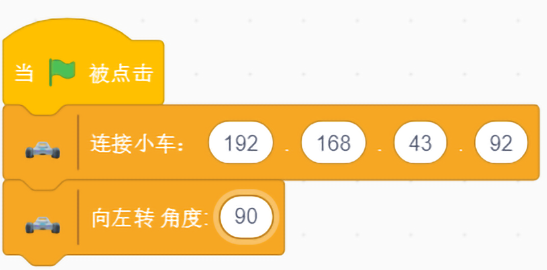
### 6. 小车右转
设置小车的右转向，填入角度，控制小车向右转的角度。 

### 样例代码  
填写积木块上的IP地址连接小车，设置小车向左转角度为90，点击小旗子运行。  

### 7. 打开窗口
点击打开窗口按钮，可通过窗口的方向盘控制小车前进方向,还可以查看小车剩余电量。 

### 样例代码  
填写积木块上的IP地址连接小车，点击小旗子运行。  

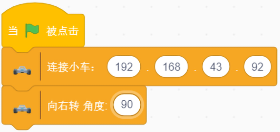
### 8. 刹车
可以让启动的小车停止行驶，同时可以设置刹车时小车的头朝向角度。    

### 样例代码  
填写积木块上的IP地址连接小车，设置小车向左转角度为90，点击小旗子运行。  

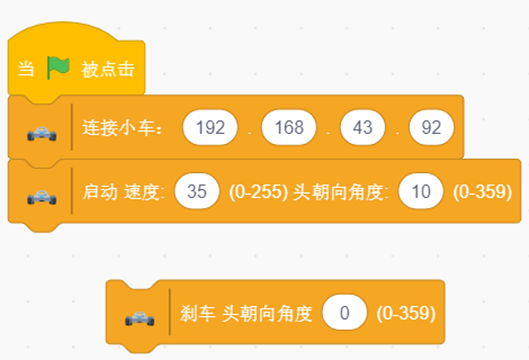
### 9. 设置小车灯的颜色
设置左侧状态指示灯,右侧状态指示灯,头部左侧灯,头部右侧灯,电池门前灯,电池门后灯,电源按钮前灯,电源按钮后灯,刹车左灯,刹车右灯,电源按钮前灯,底盘白灯颜色。

### 样例代码  
填写积木块上的IP地址连接小车，设置小车左侧状态指示灯颜色，点击小旗子运行。  

### 10. 设置全部小车灯的颜色
通过填写RGB,设置所有灯的颜色。    

### 样例代码  
填写积木块上的IP地址连接小车，设置所有的颜色为255 255 0，点击小旗子运行。  

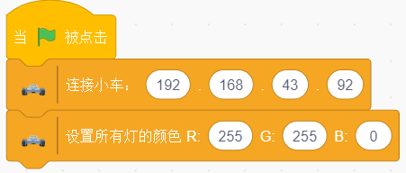
### 11. 关闭小车的灯
点击积木块，关闭小车所有灯。  

### 样例代码  
填写积木块上的IP地址连接小车，拉取“关闭所有灯”积木块，点击小旗子运行。  

### 12. 开启颜色传感器
点击积木块，开启颜色传感器。  

### 13. 当颜色发生改变
点击积木块，在颜色发生改变时，返回改变的颜色。  

### 14. 颜色的RGB值
点击积木块，获取当前返回颜色的RGB值。 

### 样例代码  
填写积木块上的IP地址连接小车，拉取“开启颜色检测”积木块，点击小旗子运行。点击“当颜色发生改变时”积木块，移动小车，让小车底部的颜色发生改变。点击“说”积木块。 

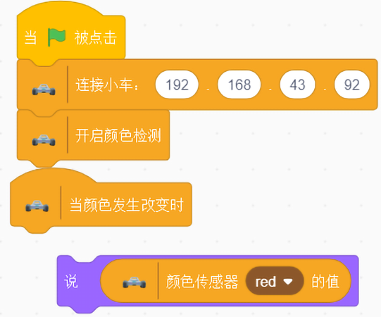
### 15. 颜色的RGB值
点击积木块，获取当前颜色的RGB值。 

### 16. 关闭颜色传感器
点击积木块，关闭颜色传感器。  

### 样例代码  
填写积木块上的IP地址连接小车，拉取“开启颜色检测”积木块，点击小旗子运行。拉取“获取当前颜色RGB”积木块和“颜色传感器的值”积木块，点击小旗子运行。移动小车，让小车底部的颜色发生改变。点击“说”积木块。

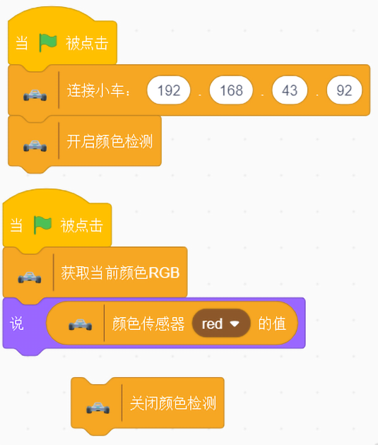

### 17. 开启传感器
点击积木块，开启传感器。  

### 18. 角度传感器
点击积木块，获取角度传感器(pitch,roll,yaw)的值。  

### 19. 速度传感器
点击积木块，获取速度传感器(MPS)的值。  

### 20. 环境光传感器
点击积木块，获取环境光传感器(light)的值。

### 21. 关闭传感器
点击积木块，关闭传感器。  

### 样例代码  
填写积木块上的IP地址连接小车，拉取“开启传感器”积木块。同时每隔1秒，说出“角度传感器”积木块，“速度传感器”积木块和“环境光传感器”积木块的值，点击小旗子运行。关闭传感器。 

 
---  

## 迷你小球
  
### 迷你小球介绍
	通过蓝牙连接小球，来控制小球行进的方向，速度和小球的颜色
sphero mini

​	

### 积木块说明
### 1. 扫描迷你小球
点击积木块进行蓝牙扫描。

### 2. 连接/断开小球
点击积木块连接(on)或者断开(off)小球。  

### 样例代码  
点击扫描迷你小球积木块后，知道连接小球的积木块的名字选项中出现扫描到迷你小球，点击积木块进行连接。

### 3. 设置LEB背光强度
设置迷你小球背光颜色。  

### 4. 设置小球RGB颜色
通过填写RGB的值，来改变小球的RGB颜色。  

### 样例代码    
扫描小球后，得到小球蓝牙信息，连接小球，将小球背光强度设为100，RGB颜色设为红色。  

### 5. 设置小球速度(0-255)和角度(0-359)  
通过填写速度和角度的值来控制小球运动，行进时间为1s。  

### 6. 重置小球
当前方向为小球的0角度。 

### 样例代码  
扫描小球后，得到小球蓝牙信息，连接小球，重置小球角度，让小球以速度100，角度为30的方向行进1s。  

