#  米家智能设备添加步骤

# 准备工作

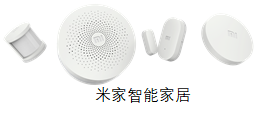 

1.米家智能家居套装（小米网关、小米门窗传感器、小米开关、人体红外传感器）

2.米家APPv5.x（Android）

	1）米家APP需要安装6.0以下的版本，最新的米家安装包（6.0及以上）无法获取token，将无法使用局域网通信。
	2）在手机应用商城或应用管理中关闭米家APP的自动更新，避免自动更新为最新版本。
	3）米家APP下载: 扫描下方二维码

 

# 添加网关步骤
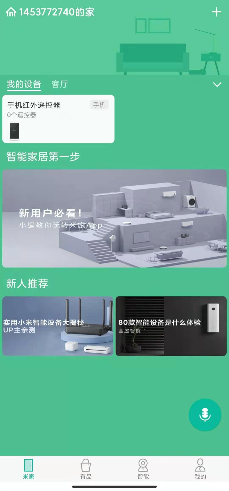 

1.将小米多功能网关插到插座上，在未配置或者未联网状态下，小米多功能网关灯会一直闪烁。

2.打开米家APP，点击右上角“加号”图标，添加设备，如上图所示:

 

 

3.添加的方式有两种：

1）APP自动扫描后添加

2）在搜索框手动输入小米多功能网关后添加

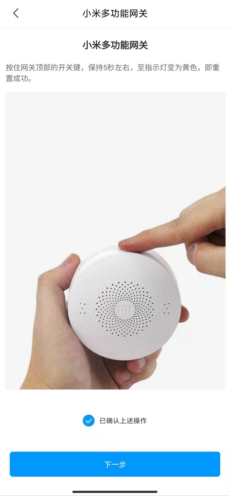 

4.按照APP提示完成小米网关重置。

 

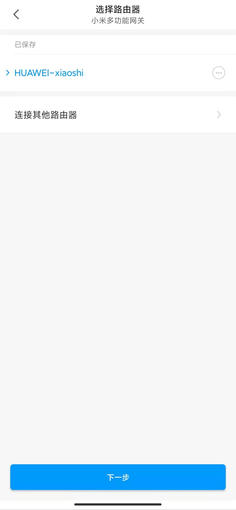 

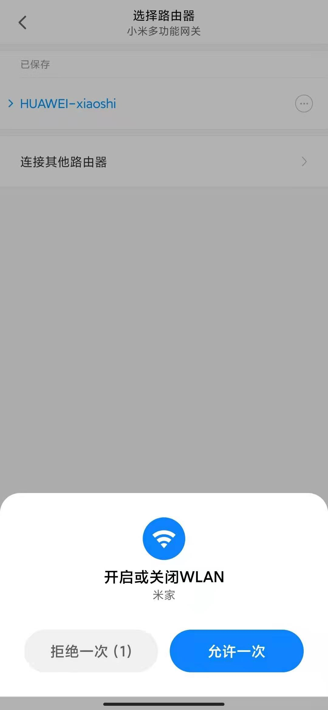 

5.配置网络：

1）点击“连接其他路由器”。

2）输入WiFi密码，网络连接成功。

3）根据提示开启WLAN。

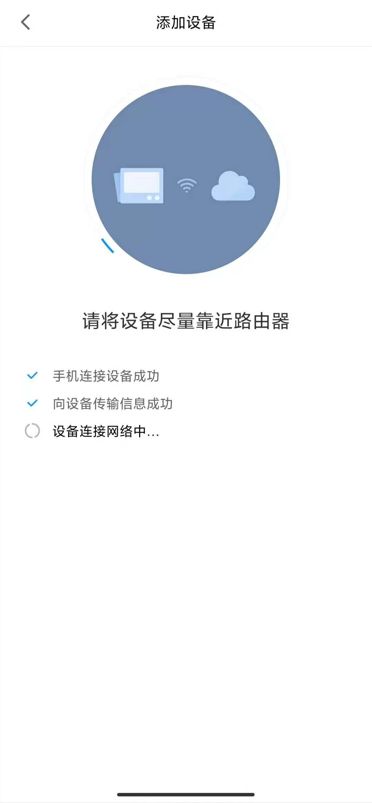 

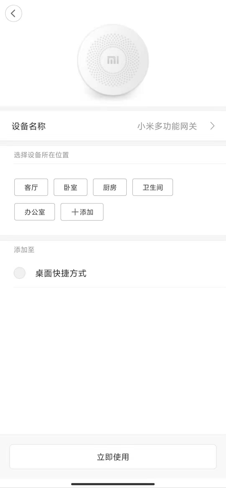 

6.添加设备,并添加成功。
如果能点亮/关闭网关灯以及变换网关灯颜色，证明操作一切正常，如果不行，请重试以上步骤重新添加小米多功能网关。

# 获取局域网访问密钥

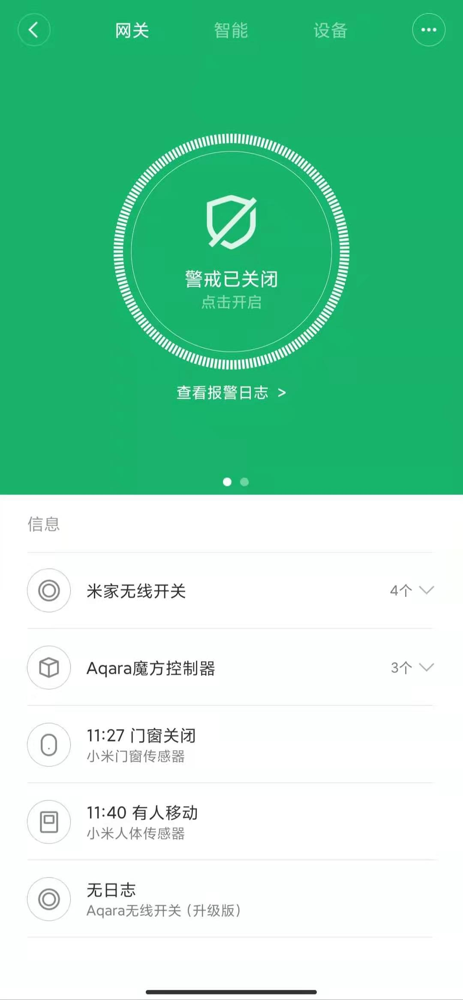 

1.点击米家，选择刚刚添加完成的小米网关，进入以下页面。

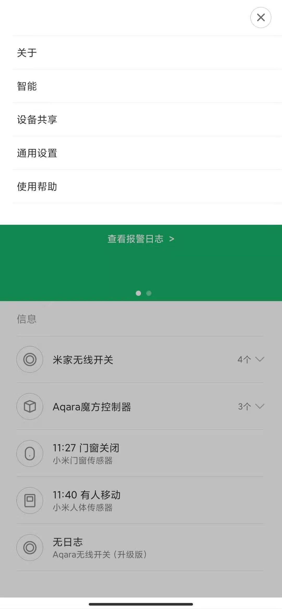 

2.点击右上角（更多），进入下图所示页面。

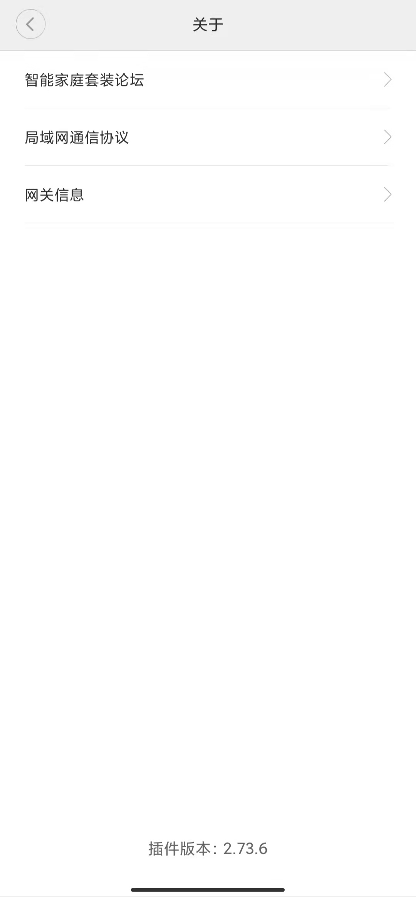 

3.点击“关于”，进入下图所示页面。注意，首次进入该页面时可能没有网关信息和局域网通信协议，此时需要连续点五次下方的插件版本才可显示。

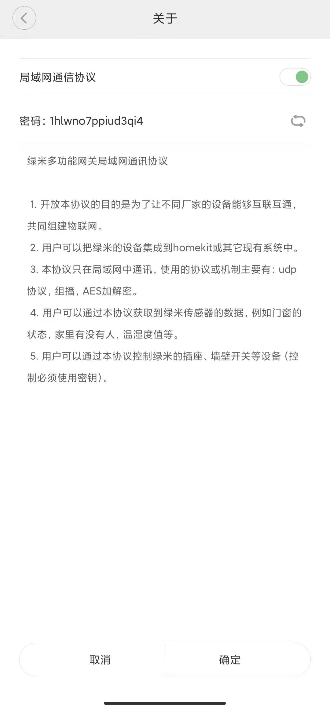 

4.点击“局域网通信协议”，如下图所示。打开“局域网通信协议”的开关，并记录密码，稍后发送给运维人员使用。注意，密码一旦生成并记录后，不可变动。

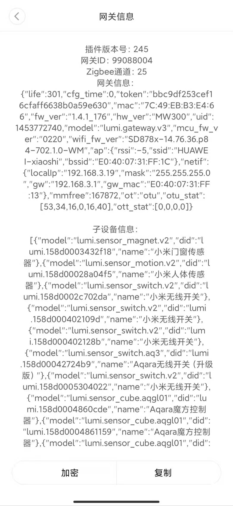

5.返回上一页面后，点击“网关信息”，并点击下方的“复制”按钮。
将前两项获取的信息，发送给运维人员。
1）局域网通信的密码
2）网关信息

# 添加网关子设备

 

1.在网关界面中选择“设备”页

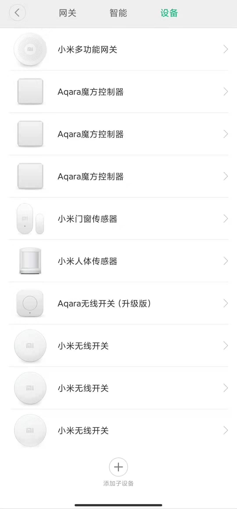 

2.点击下方添加子设备。

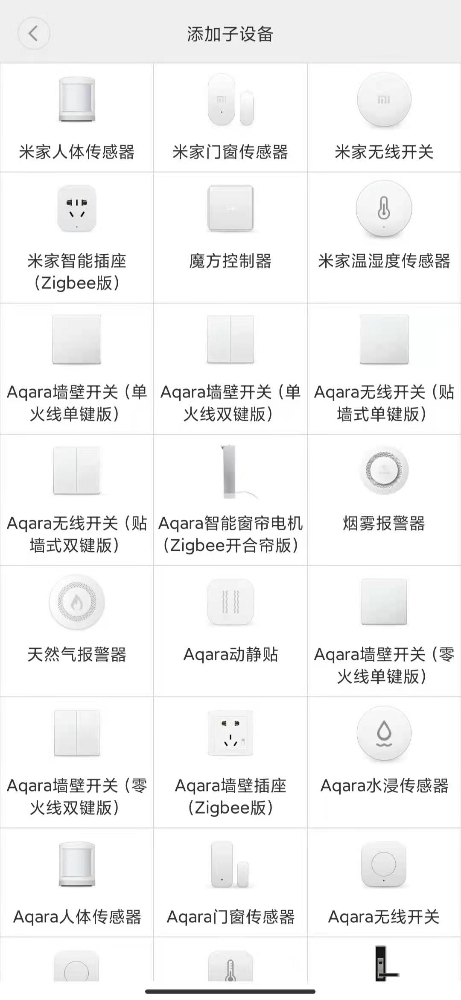 

3.在子设备列表中，依次选择需要添加的子设备。

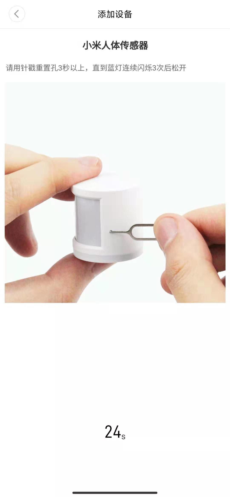 

4.下图以小米人体传感器为例，其他设备类似。

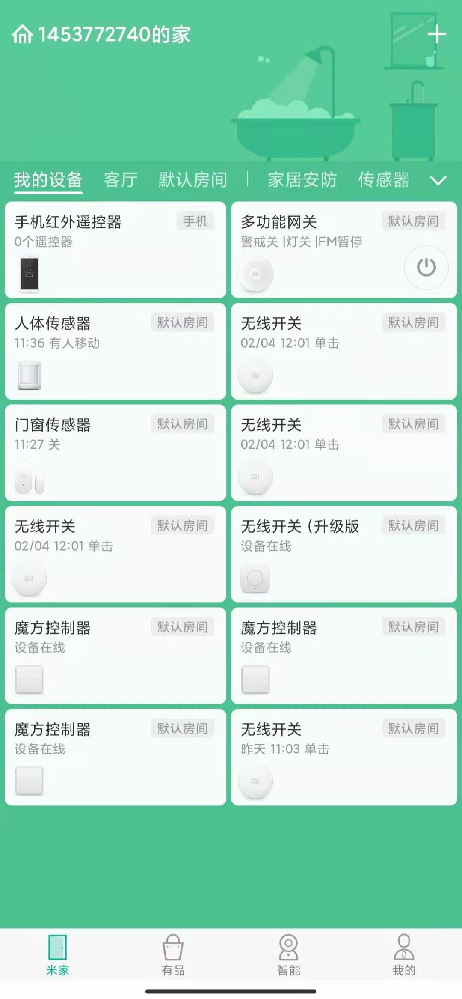 

5.添加完成后，在米家APP主页上即可看到所有可操作的设备了。